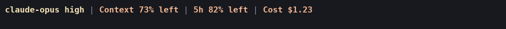
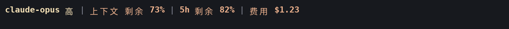

# Claude Code Statusline

**English** | [简体中文](README.zh-CN.md)

[](https://github.com/fbincon/claude-code-statusline/actions/workflows/ci.yml)
[](https://github.com/fbincon/claude-code-statusline/actions/workflows/native.yml)
[PyPI](https://pypi.org/project/fbincon-claude-code-statusline/)
[MIT License](LICENSE)

A Claude Code status line for Linux, WSL, Windows, and macOS. See model and reasoning effort, directory, Git, context, usage limits, tokens, and task timing at a glance. Configure the main line and individual subagent rows through an in-session editor, a terminal UI, a wizard, or the CLI.

[Features](#features) · [Screenshots](#screenshots) · [Quick installation](#quick-installation) · [Common configuration](#common-configuration) · [User guide](docs/USER_GUIDE.md) · [Troubleshooting](docs/USER_GUIDE.md#troubleshooting)

<a id="phase-4-in-stable-v150"></a>
<a id="phase-5-in-stable-v160"></a>
<a id="v161-clearer-external-tui-sections"></a>

## Features

- **Control visibility and appearance:** hide confirmed empty/clean states, set usage thresholds, choose per-item foreground/background colors and themes, and opt into basic [Powerline](docs/APPEARANCE.md).
- **Choose your languages:** English and 简体中文 for interfaces and actual statusline output, independently; interface changes save immediately, output language saves with display settings.
- **Find what to show:** 60 main-line items and 14 subagent items, with ranked English/Chinese search, category filters and source/requirement guidance.
- **Track the right scope:** session token totals, per-task subagent rows, and total task time covering queueing, agents and main-agent wrap-up; optional execution time excludes verified user waits.
- **Adjust presentation:** model and number formats, labels, built-in icons, colors, directory styles, and automatic or explicit rows with priorities and width limits.
- **Keep Unicode intact:** joined emoji, combining marks and CJK text stay together when rows wrap, clip or appear in previews.
- **Review configuration changes:** four editable presets and portable JSON, with import differences and candidate previews before accepting a draft and saving.
- **Choose an editor:** Main, Subagents, Settings, and Layout pages share the same configuration. Claude appearance and behavior preferences use a separate Apply action.
- **Follow Claude themes:** the in-session editor adapts text, keys and selection to the applied theme; sample previews retain production colors on a separately chosen light/dark background.
- **Follow terminal colors:** external TUI text and bold keys use terminal defaults; previews show the selected palette on the current terminal background.
- **Enable optional live metrics:** runtime state, agent count, tool progress, request timing, and per-task usage are opt-in. Missing or partial observations stay distinguishable.

Rendering uses Claude Code input and local state without making network requests or using model tokens. The question-and-answer wizard uses Claude model turns. See [field definitions](docs/DISPLAY_ITEMS.md) for data sources and availability.

<a id="界面预览"></a>

## Screenshots

[Search, categories, source guidance and import review captures](docs/images/README.md#discovery-and-import-review).


The main status line at the bottom of session screenshots shows actual data; configuration Preview regions use fixed samples. Fonts, colors and widths depend on terminal settings. [Image sources and archive](docs/images/README.md).

<details>
<summary>English / 简体中文 configuration</summary>

Linux terminal captures show the shared language selector and Chinese interface. These are reconstructions of actual PTY cells with sample previews; [sources and all pages](docs/images/README.md#bilingual-terminal-captures).


</details>

### In-session TUI

Run `/statusline-configure-native` inside the current Claude Code session, then click the Client region once before using the keyboard. The editor follows the Claude theme; choose the preview background to match the terminal and compare the selected palette. [Compare terminal/theme combinations](docs/development/native.md#terminal-background-previews).

**Linux: Main and the status line**


<details>
<summary>Linux: Subagents, Settings, Layout</summary>

**Subagents: choose items and ordering for individual agent rows.**


**Settings: adjust appearance, refresh behavior and formatting.**


**Layout: set rows, item priorities and maximum widths.**


</details>

<details>
<summary>Linux: light and dark themes</summary>

Earlier theme captures used a dark preview surface; the current editor offers a separate light/dark preview choice. These images reconstruct real terminal cells. [Capture provenance](docs/images/README.md#theme-terminal-captures).


</details>

<details>
<summary>Windows: Main, Subagents, Settings, Layout</summary>

**Main: select and reorder main status line items.**


**Subagents: choose items and ordering for individual agent rows.**


**Settings: adjust appearance, refresh behavior and formatting.**


**Layout: set rows, item priorities and maximum widths.**


</details>

<details>
<summary>macOS: Main</summary>

Only Main was supplied for this batch. The existing interaction limitation and checks are documented in [macOS mouse reporting and Client focus](docs/USER_GUIDE.md#macos-mouse-reporting-and-client-focus).

**Main: select and reorder main status line items.**


</details>

### External TUI

Run `/statusline-configure` in Claude Code, or `claude-statusline configure` in a standalone terminal.

<details>
<summary>Linux: light/dark backgrounds and palette comparison</summary>

Previews use the current terminal background and selected palette. Compare `ansi` in Settings when `default` looks faint. These are terminal-output reconstructions from dedicated GNOME profiles; [capture sources](docs/images/README.md#external-terminal-color-captures).

**Light background, Palette: default**


**Light background, Palette: ansi**


**Dark background, Palette: default**


</details>

<details>
<summary>Linux: Main, Subagents, Settings, Layout</summary>

**Main: select and reorder main status line items.**


**Subagents: choose items and ordering for individual agent rows.**


**Settings: adjust appearance, refresh behavior and formatting.**


**Layout: set rows, item priorities and maximum widths.**


</details>

<details>
<summary>Windows: Main, Subagents, Settings, Layout</summary>

**Main: select and reorder main status line items.**


**Subagents: choose items and ordering for individual agent rows.**


**Settings: adjust appearance, refresh behavior and formatting.**


**Layout: set rows, item priorities and maximum widths.**


</details>

<details>
<summary>macOS: Main, Subagents, Settings, Layout</summary>

**Main: select and reorder main status line items.**


**Subagents: choose items and ordering for individual agent rows.**


**Settings: adjust appearance, refresh behavior and formatting.**


**Layout: set rows, item priorities and maximum widths.**


</details>

Earlier screenshots and terminal reconstructions remain in the [archive](docs/images/archive/README.md).

## Supported platforms

| Platform | Supported environment |
| --- | --- |
| Linux / WSL | Python 3.10+ |
| Windows 10/11 | CPython 3.10–3.14, x86/x64; `windows-curses>=2.4.2` installs automatically |
| macOS 14+ | CPython 3.10–3.14, Intel / Apple Silicon |

Windows ARM devices can use x64 Python emulation; native ARM64 Python is outside the current support contract. Git information requires `git`.

Claude Code feature requirements: subagent rows 2.1.205+; local argument-based configuration and external TUI entry 2.1.258+; in-session Client 2.1.287+; native timing and advanced live-metrics collection 2.1.289+. Unsupported or unknown host versions suspend the corresponding integration. See [requirements](docs/USER_GUIDE.md#requirements).

<a id="install-current-source"></a>
<a id="install-from-a-release-recommended"></a>
<a id="install-source-at-a-fixed-tag"></a>
<a id="从-release-安装推荐"></a>
<a id="从固定标签源码安装"></a>
<a id="从当前源码安装"></a>
<a id="升级与卸载"></a>
<a id="常用配置"></a>
<a id="快速安装"></a>
<a id="接入-claude-code"></a>
<a id="支持范围"></a>
<a id="文档与帮助"></a>
<a id="许可证"></a>

## Quick installation

Install Python, Claude Code CLI, and [pipx](https://pipx.pypa.io/latest/how-to/install-pipx.html). All supported platforms use the same wheel.

### Install the package

Bash, Zsh, and PowerShell:

```text
pipx install fbincon-claude-code-statusline
pipx ensurepath
```

### Integrate with Claude Code

Reopen the terminal so PATH changes take effect, then run:

```text
claude-statusline --version
claude-statusline install --dry-run
claude-statusline install
claude-statusline doctor
```

On Windows, use `claude-statusline.exe`. Restart Claude Code in a trusted terminal after integration.

Both editors default on for compatible hosts, respecting saved disablement preferences. Native timing metadata defaults on for Claude Code 2.1.289+; advanced live metrics remain opt-in. Package installation and Claude integration are separate steps; `install` does not open an editor. Existing conflicting resources require [explicit handling](docs/USER_GUIDE.md#handle-an-existing-status-line-or-skill-with-the-same-name).

<details>
<summary>Other installation methods</summary>

Install the development source (requires Git):

```text
pipx install "git+https://github.com/fbincon/claude-code-statusline.git@main"
```

Run `pipx install .` from a local checkout. Fixed-tag installation and verified Release wheels are covered in the installation guide. Then run `pipx ensurepath` and complete integration above.

Download checksums and platform-specific instructions are in the [installation guide](docs/USER_GUIDE.md#installation-and-integration); source builds are in the [development guide](docs/development/README.md#build-and-install-from-source).

</details>

## Common configuration

[Find items, understand their sources, and review imports](docs/USER_GUIDE.md#item-discovery-import-review).


| Entry point | Use |
| --- | --- |
| `/statusline-configure-native` | Client TUI in the current session; see [native editor](docs/USER_GUIDE.md#native-configuration-editor) |
| `/statusline-configure` | TUI in a supported external terminal; see [external entry](docs/USER_GUIDE.md#external-terminal-statusline-configure) |
| `claude-statusline configure` | Full TUI in the current standalone terminal |
| `/statusline-config` | Claude question-and-answer wizard; supported argument-based commands execute locally on compatible hosts |
| `claude-statusline config ...` | Inspect settings, set exact ordering, or configure from scripts |

<a id="v130a2-external-tui-and-in-session-client"></a>

### Interface language

Both editors have **Interface language (saved immediately)** in Settings, with choices **English / 简体中文**. The default is English. Switching keeps your page, selection, search and unsaved display edits; cancelling display changes keeps the language choice. Other open windows read it when reopened or reloaded.

```text
claude-statusline config language set zh-CN
claude-statusline config language show
claude-statusline config language reset
claude-statusline --language en --help
```

`--language en|zh-CN` precedes the command and affects only that invocation; for `configure` it sets the initial language. Commands, IDs, configuration values and custom text retain their values. Interface language does not change output language. See [language settings](docs/USER_GUIDE.md#interface-language).

### Statusline language

Choose **Statusline language (save with display settings)** → **English / 简体中文** in either editor. Preview switches immediately; Save changes the actual main and subagent output on the next refresh, while Cancel discards the draft. English is the default.

```text
claude-statusline config set statusline-language zh-CN
claude-statusline config set statusline-language en
```





These are [real CLI terminal captures with fixed input](docs/images/README.md#statusline-language-captures).

Built-in labels and known states are translated. Technical units, model names, branches, paths and custom text are preserved. See [output language](docs/USER_GUIDE.md#statusline-language).

### Native configuration editor

Click the Client region once. Use Tab to change pages, Space to toggle, arrows to select or reorder, Ctrl+E for item formatting and source guidance, `/` to search, and Ctrl+F for categories. Clear filters before reordering. `S` saves and stays, `F` saves and closes, and `Q` discards unsaved changes; lowercase letters work too. Footer controls follow the current page or input mode. Ctrl+G cancels input. Claude preferences apply separately.

### External and standalone terminal TUI

Use Tab to change pages, Space to toggle, and arrows to select or reorder. Ctrl+S saves after field input is finished; Enter saves on item and original settings rows, or edits/confirms advanced fields. Esc cancels input first, then cancels the editor; Ctrl+C interrupts without saving. The minimum terminal size is 64×18.

The external entry uses tmux or GNOME Terminal on Linux, tmux or Terminal.app on macOS, and the system's new-console launcher on Windows. For SSH or unavailable launchers, run `claude-statusline configure` in the current terminal.

Define a compact main line:

```text
claude-statusline config set-items model-with-effort current-dir git context-remaining task-timer
claude-statusline config set directory-style home
claude-statusline config show
```

Configuration is per user. `set-items` replaces the enabled set; `enable` and `disable` make incremental changes. See [recipes](docs/USER_GUIDE.md#configuration-recipes), [formatting and layouts](docs/USER_GUIDE.md#formatting-layout-presets), and the [CLI reference](docs/reference/cli.md).

<a id="upgrade-to-v161"></a>

## Upgrading and uninstalling

Upgrade the package, synchronize integration, then restart Claude Code:

```text
pipx upgrade fbincon-claude-code-statusline
claude-statusline install
claude-statusline doctor
```

Existing wheel installations from this repository should first follow the [package-name migration](docs/USER_GUIDE.md#migrate-the-previous-distribution-name). Saved display settings, runtime state, and integration preferences remain. For older display schemas or package downgrade, follow [version compatibility](docs/USER_GUIDE.md#version-compatibility).

Remove Claude integration before uninstalling the package:

```text
claude-statusline uninstall --dry-run
claude-statusline uninstall
pipx uninstall fbincon-claude-code-statusline
```

Display settings and backups remain available; see [uninstalling](docs/USER_GUIDE.md#uninstalling).

## Project structure

```text
claude-code-statusline/
├── .github/workflows/                       # GitHub Actions workflows
│   ├── ci.yml                               # Cross-platform tests and distribution builds
│   ├── native.yml                           # Mod validation, type checks and installation tests
│   └── publish.yml                          # PyPI/TestPyPI publication and install verification
├── README.md / README.zh-CN.md              # Project overview and quick start
├── CHANGELOG.md / CHANGELOG.zh-CN.md        # Versioned change history
├── LICENSE                                  # MIT license
├── MANIFEST.in                              # Source distribution file selection
├── pyproject.toml                           # Package metadata, dependencies and build configuration
├── docs/                                    # User, reference and development documentation
│   ├── USER_GUIDE.md / USER_GUIDE.zh-CN.md  # Installation, configuration and troubleshooting
│   ├── reference/                           # CLI and configuration reference
│   ├── images/                              # Current TUI screenshots and historical archives
│   │   ├── tui/                             # Current configuration editor screenshots
│   │   │   ├── native/                      # In-session configuration editor screenshots
│   │   │   └── external/                    # External terminal configuration editor screenshots
│   │   ├── discovery/                       # Search, source guidance and import-review captures
│   │   └── archive/                         # Historical screenshots and UI reconstructions
│   ├── development/                         # Development setup, architecture and validation
│   └── releases/                            # Historical release notes
├── src/                                     # Python source and build extensions
│   ├── build_native.py                      # Mod resource bundling and package README link rewriting
│   └── claude_statusline/                   # Python CLI and implementation modules
│       ├── config/                          # Configuration models, storage, migrations and commands
│       │   ├── catalog.py / guidance.py      # Scoped definitions and static source/requirement metadata
│       │   ├── import_review.py              # Semantic differences between validated drafts
│       │   ├── ui_preferences.py            # Shared language preference transactions
│       │   └── storage.py                   # Locks, backups and atomic writes
│       ├── i18n/                            # Shared English/Chinese presentation resources
│       │   ├── locales/                     # en.json / zh-CN.json
│       │   ├── translator.py                # Message keys, parameters and English fallback
│       │   ├── statusline.py                # Explicit-language output and known-value presentation
│       │   ├── _generated_statusline.py      # Generated lightweight runtime dictionary
│       │   └── presentation.py              # Localized fields and choices
│       ├── integration/                     # Claude Code setup, install transactions, hooks and diagnostics
│       ├── platforms/                       # Cross-platform files, processes, clocks and terminals
│       ├── rendering/                       # Statusline formatting, colors, layout and previews
│       ├── runtime/                         # Session data collection, caches and task state
│       │   ├── live/                        # Independent observation protocol, aggregation and storage
│       │   ├── tasks/                       # User task ownership, lifecycle and timing state
│       │   ├── timing/                      # Pure pause/resume clock logic
│       │   └── turns/                       # Compatibility aliases forwarding to tasks/
│       ├── resources/                       # Bundled configuration skill templates
│       └── ui/                              # Editor state, search, guidance, import review and JSON backend
├── mods/                                    # Claude Code TypeScript Mods
│   ├── statusline-native/                   # In-session configuration editor Mod
│   │   ├── hooks/                           # Host APIs, commands, saves and recovery
│   │   ├── lib/                             # Backend, drafts, input and independent snapshots
│   │   │   └── i18n/                       # Generated locales, semantic messages and presentation
│   │   ├── ui/                              # Client drawing, components, theme and geometry
│   │   │   └── theme.ts                     # Host color roles and independent preview surface
│   │   └── tests/                           # Tests grouped by backend, client, editor, integration and UI
│   └── statusline-runtime/                  # Native task timing and optional advanced metrics Mod
├── tests/                                   # Python unit and integration tests
│   ├── fixtures/                            # Shared language-neutral editor search cases
│   ├── config/                              # Configuration, formatting, migration and transfer tests
│   ├── i18n/                                # Translation resources and fallback tests
│   ├── integration/                         # CLI, installation, packaging and compatibility tests
│   ├── platforms/                           # Platform adapters and terminal integration tests
│   ├── rendering/                           # Statusline formatting, layout and metric display tests
│   ├── runtime/                             # Session state, task lifecycle and timing tests
│   └── ui/                                  # Configuration editor, layout and protocol tests
└── tools/                                   # Development, validation and release utilities
    ├── generate_i18n.py                     # Validate resources and generate TypeScript locales
    ├── inspect_dist.py                      # Wheel/sdist metadata, contents and exclusion checks
    ├── publish_package.py                   # Release asset validation and package index install checks
    └── check_docs.py                        # Documentation links, anchors and bilingual pair checks
```

## Documentation and help

- [User guide](docs/USER_GUIDE.md): installation, editors, recipes, upgrades, and troubleshooting.
- [CLI reference](docs/reference/cli.md): commands, options, fields, files, and exit codes.
- [Display items and metric definitions](docs/DISPLAY_ITEMS.md): scope, sources, and availability.
- [Development guide](docs/development/README.md) · [Release process](docs/RELEASING.md).
- [Changelog](CHANGELOG.md) · [GitHub Releases](https://github.com/fbincon/claude-code-statusline/releases).
- [GitHub Issues](https://github.com/fbincon/claude-code-statusline/issues): include versions, reproduction steps, and diagnostic results; remove private paths and session content.

## License

[MIT License](LICENSE). Copyright (c) 2026 [fbincon](https://github.com/fbincon).

Bundled Unicode data retains the [Unicode License v3](tools/unicode/UNICODE-LICENSE.txt) and the [wcwidth MIT notice](tools/unicode/WCWIDTH-LICENSE.txt).
