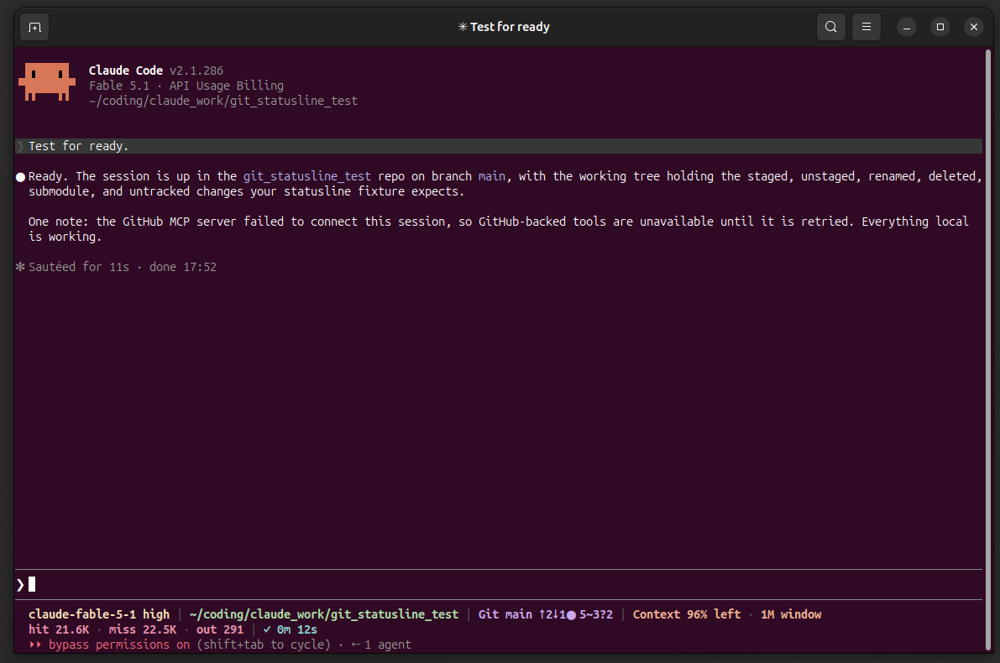
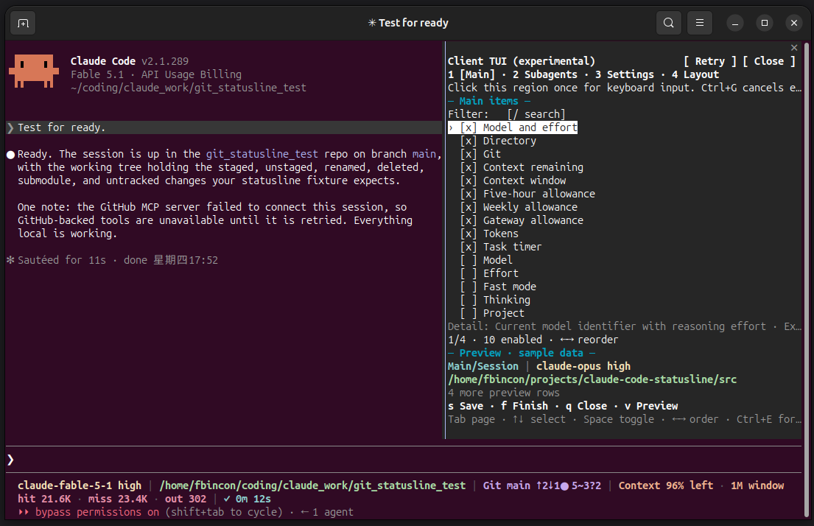
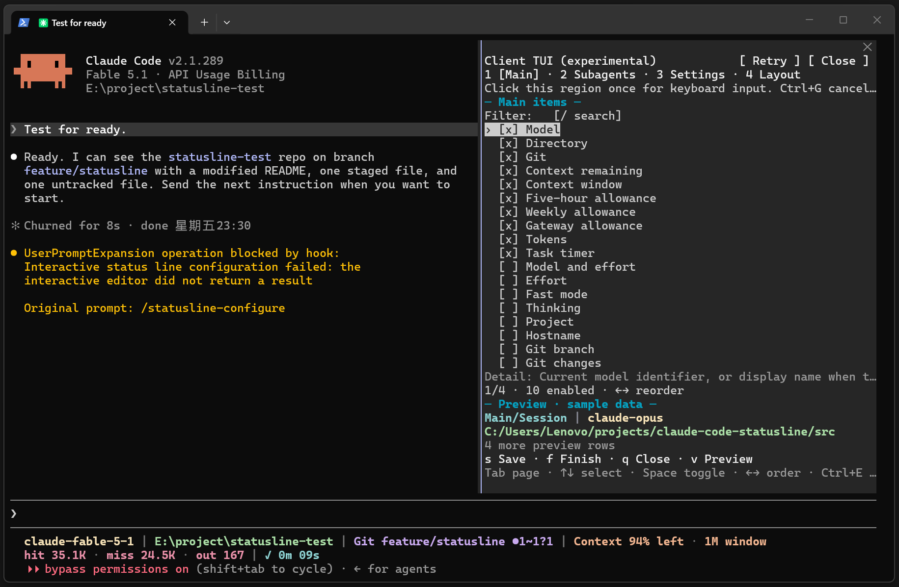
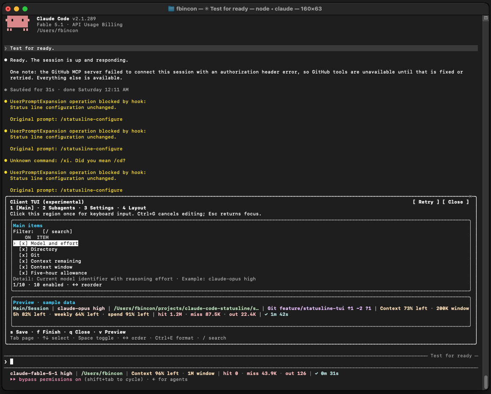
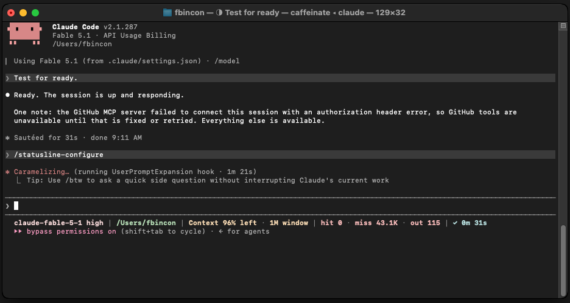
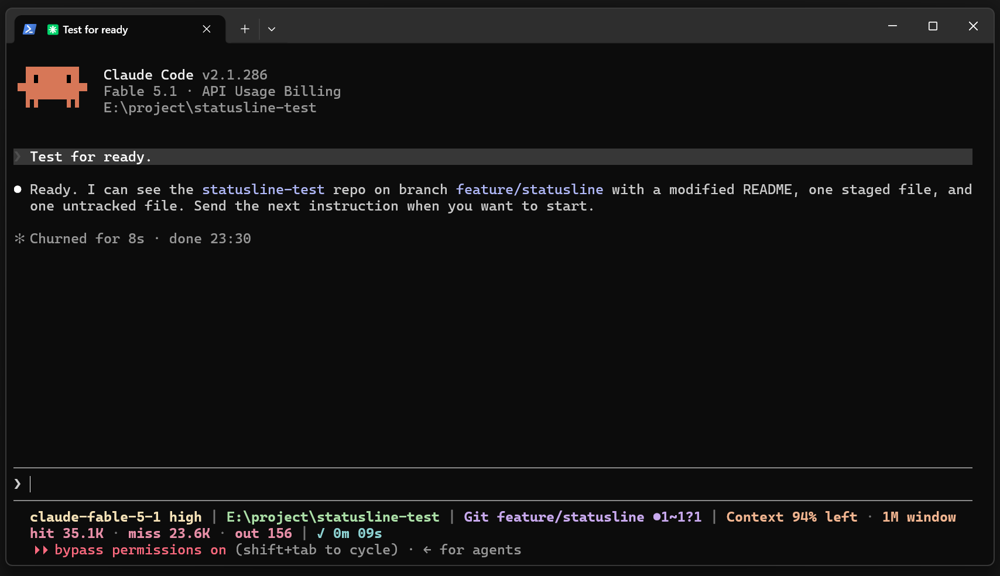

# Claude Code Statusline

**English** | [简体中文](README.zh-CN.md)

[](https://github.com/fbincon/claude-code-statusline/actions/workflows/ci.yml)
[](https://github.com/fbincon/claude-code-statusline/actions/workflows/native.yml)
[MIT License](LICENSE)

A Claude Code status line for Linux, WSL, Windows, and macOS. See model and reasoning effort, directory, Git, context, usage limits, tokens, and task timing at a glance. Configure the main line and individual subagent rows through an in-session editor, a terminal UI, a wizard, or the CLI.

[Features](#features) · [Screenshots](#screenshots) · [Quick installation](#quick-installation) · [Common configuration](#common-configuration) · [User guide](docs/USER_GUIDE.md) · [Troubleshooting](docs/USER_GUIDE.md#troubleshooting)

<a id="phase-4-in-stable-v150"></a>
<a id="phase-5-in-stable-v160"></a>
<a id="v161-clearer-external-tui-sections"></a>

## Features

- **Choose what to show:** 59 main-line items and 14 subagent items; enable, hide, search, and reorder them.
- **Track the right scope:** session token totals, per-task subagent rows, and a timer covering the user's task through subagent work and main-agent wrap-up.
- **Adjust presentation:** model and number formats, labels, built-in icons, colors, directory styles, and automatic or explicit rows with priorities and width limits.
- **Start from a preset:** minimal, developer, monitoring, and multi-agent presets expand into editable settings; import and export portable JSON.
- **Choose an editor:** Main, Subagents, Settings, and Layout pages share the same configuration. Claude appearance and behavior preferences use a separate Apply action.
- **Enable optional live metrics:** runtime state, agent count, tool progress, request timing, and prompt usage are opt-in. Missing or partial observations stay distinguishable.

Rendering uses Claude Code input and local state without making network requests or using model tokens. The question-and-answer wizard uses Claude model turns. See [field definitions](docs/DISPLAY_ITEMS.md) for data sources and availability.

<a id="界面预览"></a>

## Screenshots

Main status lines show actual session data. Configuration Preview regions use fixed samples. New TUI screenshots are supplied terminal captures; the three standalone main-status-line images are retained from the earlier gallery. Fonts, colors, and widths depend on terminal settings. [Image sources and archive](docs/images/README.md).

**Linux main status line**



<details>
<summary>In-session configuration TUI: Linux, Windows, and macOS (actual terminal screenshots)</summary>

Open `/statusline-configure-native` inside the current Claude Code session, then click the Client region once before using the keyboard. These images visibly show Claude Code 2.1.289.

**Linux**



**Windows**



**macOS**



The existing macOS Client interaction limitation and suggested checks are documented in [macOS mouse reporting and Client focus](docs/USER_GUIDE.md#macos-mouse-reporting-and-client-focus).

</details>

<details>
<summary>Linux: Main, Subagents, and Settings configuration pages</summary>

These pages use the external `/statusline-configure` TUI.

**Main: select and reorder main status line items.**


**Subagents: choose items and ordering for individual agent rows.**


**Settings: adjust appearance, refresh behavior, and formatting.**


</details>

<details>
<summary>macOS: main status line and three configuration pages in Terminal.app</summary>

**Main status line**



**Main**


**Subagents**


**Settings**


</details>

<details>
<summary>Windows: main status line and three configuration pages in Windows Terminal</summary>

**Main status line**



**Main**


**Subagents**


**Settings**


</details>

Layout screenshots are in the [layout guide](docs/USER_GUIDE.md#formatting-layout-presets). Earlier screenshots and terminal reconstructions remain in the [archive](docs/images/archive/README.md).

## Supported platforms

| Platform | Supported environment |
| --- | --- |
| Linux / WSL | Python 3.10+ |
| Windows 10/11 | CPython 3.10–3.14, x86/x64; `windows-curses>=2.4.2` installs automatically |
| macOS 14+ | CPython 3.10–3.14, Intel / Apple Silicon |

Windows ARM devices can use x64 Python emulation; native ARM64 Python is outside the current support contract. Git information requires `git`.

Claude Code feature requirements: subagent rows 2.1.205+; local argument-based configuration and external TUI entry 2.1.258+; in-session Client 2.1.287+; live-metrics collection 2.1.289+. Unsupported or unknown host versions suspend the corresponding integration. See [requirements](docs/USER_GUIDE.md#requirements).

<a id="install-current-source"></a>
<a id="install-from-a-release-recommended"></a>
<a id="install-source-at-a-fixed-tag"></a>
<a id="从-release-安装推荐"></a>
<a id="从固定标签源码安装"></a>
<a id="从当前源码安装"></a>
<a id="升级与卸载"></a>
<a id="常用配置"></a>
<a id="快速安装"></a>
<a id="接入-claude-code"></a>
<a id="支持范围"></a>
<a id="文档与帮助"></a>
<a id="许可证"></a>

## Quick installation

Install Python, Claude Code CLI, and [pipx](https://pipx.pypa.io/latest/how-to/install-pipx.html). All supported platforms use the same wheel.

### Install the package

Bash, Zsh, and PowerShell:

```text
pipx install "https://github.com/fbincon/claude-code-statusline/releases/download/v1.6.1/claude_code_statusline-1.6.1-py3-none-any.whl"
pipx ensurepath
```

### Integrate with Claude Code

Reopen the terminal so PATH changes take effect, then run:

```text
claude-statusline --version
claude-statusline install --dry-run
claude-statusline install
claude-statusline doctor
```

On Windows, use `claude-statusline.exe`. Restart Claude Code in a trusted terminal after integration.

Both editors default on for compatible hosts, respecting saved disablement preferences. Live collection defaults off. Package installation and Claude integration are separate steps; `install` does not open an editor. Existing conflicting resources require [explicit handling](docs/USER_GUIDE.md#handle-an-existing-status-line-or-skill-with-the-same-name).

<details>
<summary>Other installation methods</summary>

Install source from the fixed release tag (requires Git):

```text
pipx install "git+https://github.com/fbincon/claude-code-statusline.git@v1.6.1"
```

Use `@main` to follow current development, or run `pipx install .` from a local checkout. Then run `pipx ensurepath` and complete integration above.

Download checksums and platform-specific instructions are in the [installation guide](docs/USER_GUIDE.md#installation-and-integration); source builds are in the [development guide](docs/development/README.md#build-and-install-from-source).

</details>

## Common configuration

| Entry point | Use |
| --- | --- |
| `/statusline-configure-native` | Client TUI in the current session; see [native editor](docs/USER_GUIDE.md#native-configuration-editor) |
| `/statusline-configure` | TUI in a supported external terminal; see [external entry](docs/USER_GUIDE.md#external-terminal-statusline-configure) |
| `claude-statusline configure` | Full TUI in the current standalone terminal |
| `/statusline-config` | Claude question-and-answer wizard; supported argument-based commands execute locally on compatible hosts |
| `claude-statusline config ...` | Inspect settings, set exact ordering, or configure from scripts |

<a id="v130a2-external-tui-and-in-session-client"></a>

### Native configuration editor

Click the Client region once. Use Tab to change pages, arrows to select or reorder, Space to toggle, and `/` to search. `s` saves and stays, `f` saves and closes, and `q` discards unsaved changes. Ctrl+E opens item formatting; Ctrl+G cancels input. Claude preferences apply separately.

### External and standalone terminal TUI

Use Tab to change pages, Space to toggle, and arrows to select or reorder. Ctrl+S saves after field input is finished; Enter saves on item and original settings rows, or edits/confirms advanced fields. Esc cancels input first, then cancels the editor; Ctrl+C interrupts without saving. The minimum terminal size is 64×18.

The external entry uses tmux or GNOME Terminal on Linux, tmux or Terminal.app on macOS, and the system's new-console launcher on Windows. For SSH or unavailable launchers, run `claude-statusline configure` in the current terminal.

Define a compact main line:

```text
claude-statusline config set-items model-with-effort current-dir git context-remaining prompt-timer
claude-statusline config set directory-style home
claude-statusline config show
```

Configuration is per user. `set-items` replaces the enabled set; `enable` and `disable` make incremental changes. See [recipes](docs/USER_GUIDE.md#configuration-recipes), [formatting and layouts](docs/USER_GUIDE.md#formatting-layout-presets), and the [CLI reference](docs/reference/cli.md).

<a id="upgrade-to-v161"></a>

## Upgrading and uninstalling

Upgrade the package, synchronize integration, then restart Claude Code:

```text
pipx install --force "https://github.com/fbincon/claude-code-statusline/releases/download/v1.6.1/claude_code_statusline-1.6.1-py3-none-any.whl"
claude-statusline install
claude-statusline doctor
```

Saved display settings, runtime state, and integration preferences remain. For older display schemas or package downgrade, follow [version compatibility](docs/USER_GUIDE.md#version-compatibility).

Remove Claude integration before uninstalling the package:

```text
claude-statusline uninstall --dry-run
claude-statusline uninstall
pipx uninstall claude-code-statusline
```

Display settings and backups remain available; see [uninstalling](docs/USER_GUIDE.md#uninstalling).

## Project structure

```text
claude-code-statusline/
├── README.md / README.zh-CN.md
├── docs/
│   ├── USER_GUIDE.md / USER_GUIDE.zh-CN.md
│   ├── reference/                  # CLI and configuration reference
│   ├── images/                     # Current screenshots and archive
│   ├── development/                # Setup, architecture and validation
│   └── releases/                   # Historical release notes
├── src/claude_statusline/
│   ├── config/
│   ├── integration/
│   ├── platforms/
│   ├── rendering/
│   ├── runtime/
│   └── ui/
├── mods/
│   ├── statusline-native/
│   └── statusline-runtime/
├── tests/
│   ├── config/
│   ├── integration/
│   ├── platforms/
│   ├── rendering/
│   ├── runtime/
│   └── ui/
├── tools/
└── pyproject.toml
```

## Documentation and help

- [User guide](docs/USER_GUIDE.md): installation, editors, recipes, upgrades, and troubleshooting.
- [CLI reference](docs/reference/cli.md): commands, options, fields, files, and exit codes.
- [Display items and metric definitions](docs/DISPLAY_ITEMS.md): scope, sources, and availability.
- [Development guide](docs/development/README.md) · [Release process](docs/RELEASING.md).
- [Changelog](CHANGELOG.md) · [Releases](https://github.com/fbincon/claude-code-statusline/releases).
- [GitHub Issues](https://github.com/fbincon/claude-code-statusline/issues): include versions, reproduction steps, and diagnostic results; remove private paths and session content.

## License

[MIT License](LICENSE). Copyright (c) 2026 [fbincon](https://github.com/fbincon).
