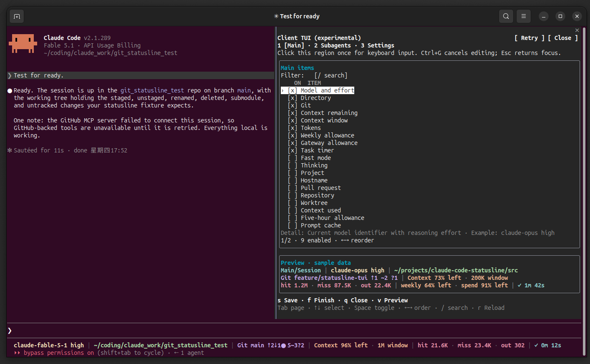
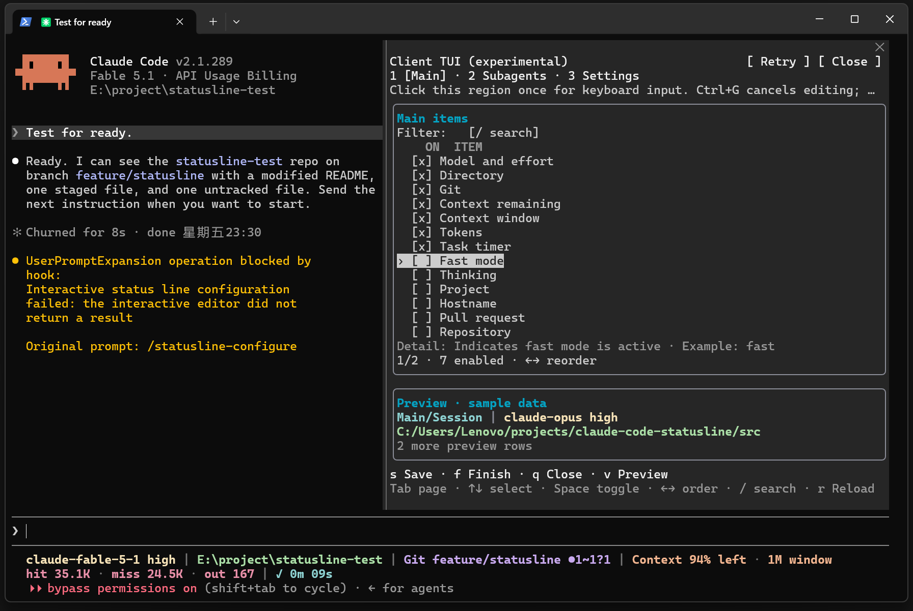
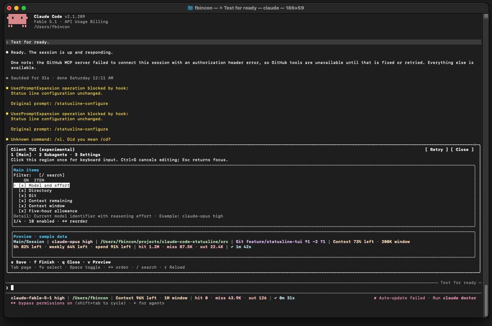
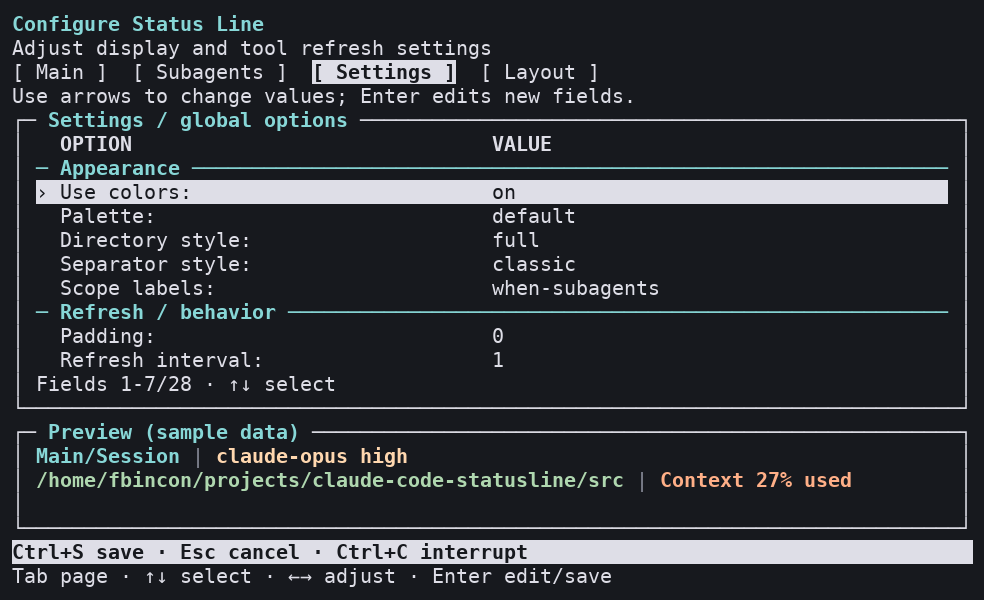
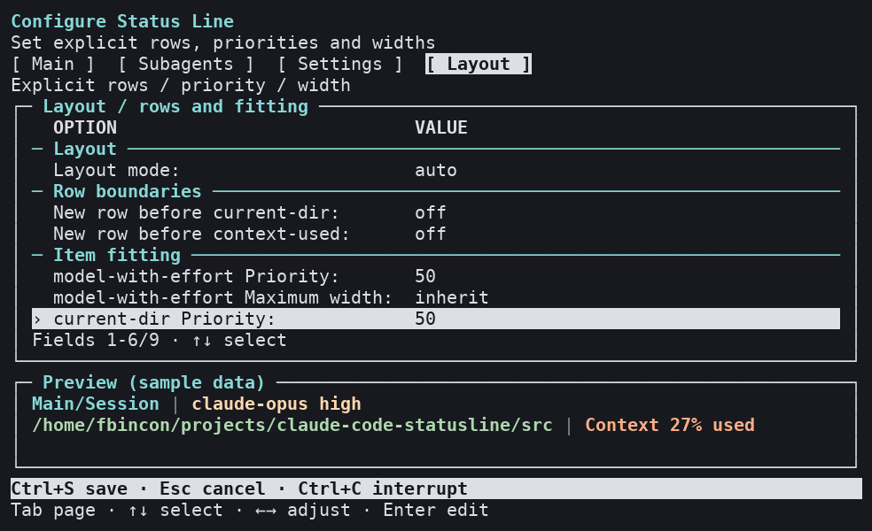
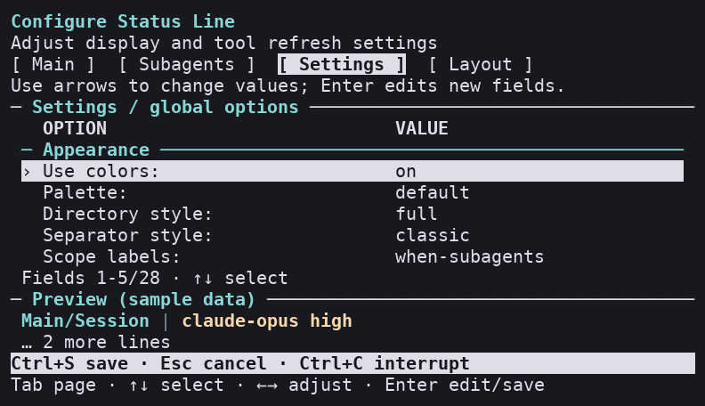
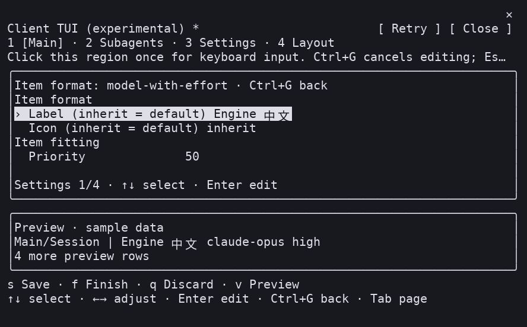
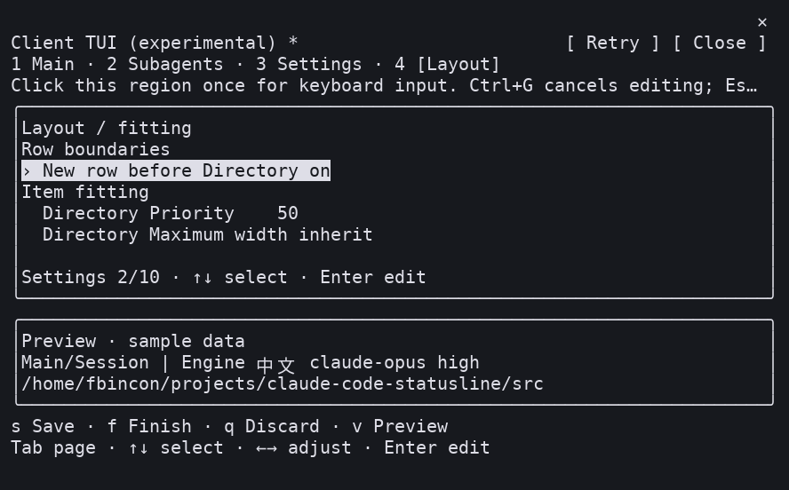
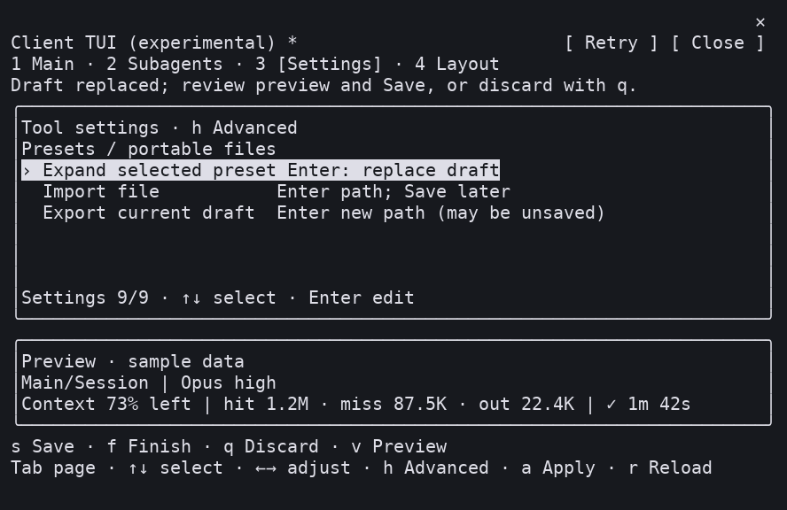
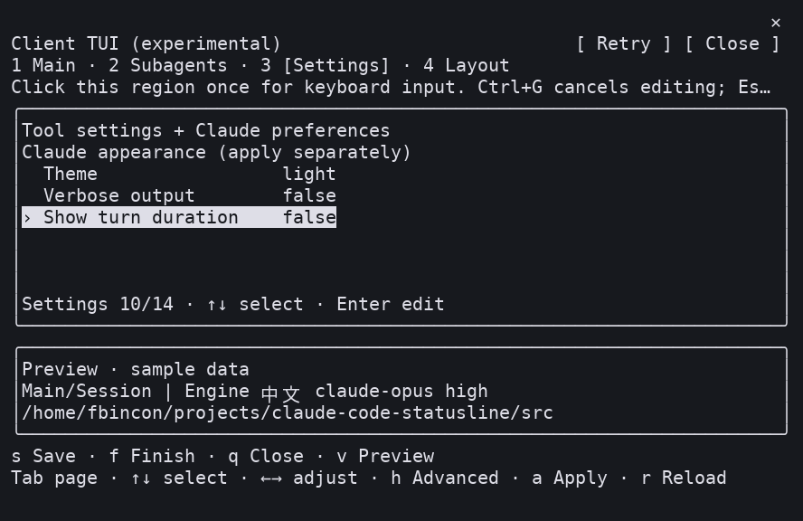

# Claude Code Statusline

**English** | [简体中文](README.zh-CN.md)

A Claude Code status line for Linux, WSL, Windows, and macOS. It shows model and reasoning effort, working directory, Git, context, rate limits, tokens, and per-turn timing. Individual subagent rows are supported. Configure items, order, and styles through a terminal UI (TUI), a wizard inside Claude Code, or the command line.

Stable v1.6.1 includes model/number formats, labels and built-in icons, risk colors, explicit rows with priorities and widths, four editable presets and portable JSON files. Both editors provide item forms and a Layout page. Claude appearance and behavior preferences have a separate Apply action. Existing default appearance is retained; [configuration and downgrade instructions](docs/USER_GUIDE.md#formatting-layout-presets) explain the options.

[Formatting, layouts and presets](docs/USER_GUIDE.md#formatting-layout-presets) · [Quick installation](#quick-installation) · [Common configuration](#common-configuration) · [User guide](docs/USER_GUIDE.md) · [Troubleshooting](docs/USER_GUIDE.md#troubleshooting) · [Report an issue](https://github.com/fbincon/claude-code-statusline/issues)

## v1.6.1: Clearer external TUI sections

`/statusline-configure` and standalone `claude-statusline configure` now use separate content and Preview regions, continuous groups, aligned columns and distinct selection. Settings groups related options; Layout separates mode, row boundaries and item fitting. Frames start at 64×20; 64×18–19 retains compact separators. Existing configuration and key semantics remain compatible. See [section behavior](docs/USER_GUIDE.md#external-tui-sections) and [release notes](docs/releases/v1.6.1.md).

## Phase 5 in stable v1.6.0

[v1.6.0](https://github.com/fbincon/claude-code-statusline/releases/tag/v1.6.0) promotes the accepted live-metrics preview: eleven opt-in items, committed branch comparisons and frozen ended-agent durations. On 2026-10-05 the maintainer confirmed v1.6.0a1 acceptance on Linux, Windows and macOS; exact OS, architecture, terminal and host versions were not supplied. Tested runtime host: Claude Code 2.1.289. Collection remains independently off by default. Enable it with `claude-statusline install --live-metrics` and select items in either editor or CLI. See [definitions and conditional availability](docs/DISPLAY_ITEMS.md#request-coverage-and-sdk-fallback), [release notes](docs/releases/v1.6.0.md) and [installation](docs/USER_GUIDE.md#phase-5-stable-installation). The existing macOS Client input limitation remains documented.

<a id="phase-4-in-stable-v150"></a>

## Upgrade to v1.6.1

Stable installation requests both editor entries on compatible hosts, preserving each recorded disablement. Upgrade the package, synchronize integration and restart Claude Code:

```bash
pipx install --force "https://github.com/fbincon/claude-code-statusline/releases/download/v1.6.1/claude_code_statusline-1.6.1-py3-none-any.whl"
claude-statusline install
claude-statusline doctor
```

Upgrading from v1.6.0 needs no display migration and retains saved configuration and editor preferences.

Upgrading from v1.6.0a1 retains display schema v4, configuration protocol v3 and independent runtime protocol v1. Older display v1/v2/v3 files migrate with a backup only on an actual save; use the [downgrade instructions](docs/USER_GUIDE.md#version-compatibility) before returning to an older package. Missing editor preferences follow stable defaults; explicit false remains off. Live-metrics preferences persist independently. To deliberately enable both editors, use `install --experimental-slash-tui --native-editor`. The [historical v1.6.0a1 preview](https://github.com/fbincon/claude-code-statusline/releases/tag/v1.6.0a1) and its assets remain available.

<a id="界面预览"></a>

## Screenshots

The actual terminal screenshots below show Linux, macOS, and Windows sessions. The main status line shows session data; the configuration UI's Preview uses fixed sample data. Historical Linux Client captures are terminal-cell reconstructions, with provenance in the image index. Fonts, colors, and character widths depend on terminal settings.

**Linux main status line**


<details>
<summary>In-session configuration TUI: Linux, Windows, and macOS (actual terminal screenshots)</summary>

Use `/statusline-configure-native` to open the Client TUI inside the current Claude Code session. These screenshots show Claude Code 2.1.289; the configuration Preview uses sample data.

**Linux: the maintainer reports normal interaction.**



**Windows: the maintainer reports normal interaction.**



**macOS: the pane opens, but the maintainer reports interaction problems; a working configuration has not been verified.**



See [macOS mouse reporting and Client focus](docs/USER_GUIDE.md#macos-mouse-reporting-and-client-focus) for suggested checks and [screenshot provenance](docs/images/README.md#in-session-client-screenshots) for the supplied images and their limits.

</details>

<details>
<summary>v1.6.1: External TUI groups and compact layout (Linux terminal reconstructions)</summary>

These images reconstruct real curses PTYs from the installed wheel. Preview uses fixed samples; [capture provenance](docs/images/README.md#external-tui-v161) records the source, dimensions and inspection type.





[Main](docs/images/external-main-v1.6.1-linux.png) · [Subagents](docs/images/external-subagents-v1.6.1-linux.png) · [Item format](docs/images/external-format-v1.6.1-linux.png) · [Compact Layout](docs/images/external-layout-compact-v1.6.1-linux.png)

</details>

<details>
<summary>Historical Linux: Main, Subagents, and Settings configuration pages</summary>

**Main: select main status line items and change their order.**


**Subagents: configure subagent row items and order.**


**Settings: change colors, directory style, separators, refresh interval, and other options.**


</details>

<details>
<summary>macOS: main status line and all three configuration pages in Terminal.app</summary>

**Main status line**


**Main: main status line items and sample preview**


**Subagents: subagent rows and sample preview**


**Settings: display styles and host settings**


</details>

<details>
<summary>Windows: main status line and all three configuration pages in Windows Terminal</summary>

**Main status line**


**Main: main status line items and sample preview**


**Subagents: subagent rows and sample preview**


**Settings: display styles and host settings**


</details>

<details>
<summary>v1.5.0a1: item formats, Layout, presets and Claude preferences (Linux terminal reconstructions)</summary>









[Compact Layout and capture provenance](docs/images/README.md#v150a1-phase-4-captures). Phase 4 human acceptance is confirmed; the images retain their original preview provenance.

</details>

[Image file index](docs/images/README.md)

<details>
<summary>In-session Client: Main, Subagents, Settings (reconstructed a2 captures; stable keeps the same interaction)</summary>


[Capture provenance and human acceptance](docs/images/README.md#v130a2-client-captures).

</details>

<a id="支持范围"></a>

## Supported platforms

- Native Linux and WSL: Python 3.10+.
- Native Windows 10/11: CPython 3.10–3.14, x86/x64; installs `windows-curses>=2.4.2` automatically. ARM devices can use x64 Python emulation.
- macOS 14+: CPython 3.10–3.14, Intel / Apple Silicon.
- Claude Code 2.1.205+ supports subagent rows; 2.1.258+ supports the external TUI entry and local configuration commands with arguments; 2.1.287+ supports the in-session Client.
- Unsupported or unrecognized hosts suspend the affected entries; the main status line, standalone TUI, wizard and CLI remain available. Git information requires `git`.

The current stable release is [**v1.6.1**](https://github.com/fbincon/claude-code-statusline/releases/tag/v1.6.1), using the same wheel across platforms. Phase 5 acceptance is confirmed on Linux, Windows and macOS; the earlier macOS Client input limitation remains. See [macOS checks](docs/USER_GUIDE.md#macos-mouse-reporting-and-client-focus) and [requirements](docs/USER_GUIDE.md#requirements).

<a id="快速安装"></a>

## Quick installation

Prepare Python, Claude Code CLI and [pipx](https://pipx.pypa.io/latest/how-to/install-pipx.html). Download verification, platform steps and builds are in the [user guide](docs/USER_GUIDE.md#install-the-python-package).

<a id="从-release-安装推荐"></a>

### Install from a Release (recommended)

Bash / Zsh / PowerShell:

```text
pipx install "https://github.com/fbincon/claude-code-statusline/releases/download/v1.6.1/claude_code_statusline-1.6.1-py3-none-any.whl"
pipx ensurepath
```

<a id="从固定标签源码安装"></a>

### Install source at a fixed tag

Requires Git:

```text
pipx install "git+https://github.com/fbincon/claude-code-statusline.git@v1.6.1"
pipx ensurepath
```

<a id="从当前源码安装"></a>

### Install current source

`main` changes during development; for a local checkout run `pipx install .` in its root:

```text
pipx install "git+https://github.com/fbincon/claude-code-statusline.git@main"
pipx ensurepath
```

<a id="接入-claude-code"></a>

### Integrate with Claude Code

Reopen the terminal for PATH changes and confirm `claude-statusline 1.6.1`:

```text
claude-statusline --version
claude-statusline install --dry-run
claude-statusline install
claude-statusline doctor
```

On Windows use `claude-statusline.exe`. Package installation and Claude integration are separate steps. Restart Claude Code in a trusted terminal afterward to load the plugin and commands. Stable defaults both entries on, preserving recorded disablement; unsupported hosts suspend them independently. Installation opens neither an editor nor another terminal. Foreign resources are checked by entry ownership; see [conflict handling](docs/USER_GUIDE.md#handle-an-existing-status-line-or-skill-with-the-same-name).

<a id="常用配置"></a>

## Common configuration

| Entry point | Purpose |
| --- | --- |
| `/statusline-configure-native` | Client TUI inside the current Claude Code session; default on, requires 2.1.287+; see [Native configuration editor](docs/USER_GUIDE.md#native-configuration-editor) |
| `/statusline-configure` | Existing TUI in a platform terminal; default on, requires 2.1.258+; see [external terminal entry](docs/USER_GUIDE.md#external-terminal-statusline-configure) |
| `claude-statusline configure` | Complete TUI in the current standalone terminal; Windows uses `claude-statusline.exe configure` |
| `/statusline-config` | Claude-driven wizard; arguments execute locally or in a model turn according to host capabilities |
| `claude-statusline config ...` | Inspect configuration, set exact order or run scripts |

<a id="v130a2-external-tui-and-in-session-client"></a>

### Native configuration editor

Run `/statusline-configure-native`, **click the Client region once**, then use Tab for pages, arrows for selection/order, Space for toggles, `/` for search and Ctrl+G to cancel input. `s` saves/continues, `f` saves/finishes and `q` discards/closes; Esc belongs to the host. Settings groups appearance, refresh/display behavior and advanced Claude preferences; preferences have a separate Apply. Minimum pane body: 32×12.

For macOS Terminal.app, check **View → Allow Mouse Reporting** before clicking the Client region. This permits mouse events; the running application must also enable mouse reporting. This suggested setup has not been verified as a fix for the reported macOS problem. See [macOS mouse reporting and Client focus](docs/USER_GUIDE.md#macos-mouse-reporting-and-client-focus) for the official references, iTerm2 checks and alternative configuration entry points.

### External and standalone terminal TUI

`/statusline-configure` retains Linux tmux / GNOME Terminal, macOS tmux / Terminal.app and Windows system-console launchers. `claude-statusline configure` uses the current terminal; minimum size is 64×18. Outside numeric editing Enter saves, Esc cancels and Ctrl+C interrupts without saving.

Both editors may open concurrently; revision checks reject stale saves rather than overwriting newer configuration. Reopening Native retains its draft; `r` explicitly discards/reloads after a conflict, and `k` checks an unknown save outcome first.

See [installation combinations and compatibility](docs/USER_GUIDE.md#editor-installation-combinations-and-compatibility) for defaults, all four modes and host downgrades. Disable independently:

```text
claude-statusline install --no-native-editor
claude-statusline install --no-experimental-slash-tui
```

The historical `--experimental-slash-tui` flag continues to control the external entry independently of `--native-editor`. Example minimal main line:

```text
claude-statusline config set-items model-with-effort current-dir git context-remaining prompt-timer
claude-statusline config set directory-style home
claude-statusline config show
```

The catalog contains 59 main and 14 subagent choices; the 28 independent additions introduced in v1.4.0 remain opt-in. See [independent metrics](docs/DISPLAY_ITEMS.md) for context/cumulative scope, cache/reset expiry and examples.

Configuration applies per user. `set-items` replaces the enabled set; `enable` / `disable` make incremental changes. See [recipes](docs/USER_GUIDE.md#configuration-recipes).

<a id="升级与卸载"></a>

## Upgrading and uninstalling

Upgrade to v1.6.1:

```text
pipx install --force "https://github.com/fbincon/claude-code-statusline/releases/download/v1.6.1/claude_code_statusline-1.6.1-py3-none-any.whl"
claude-statusline install
claude-statusline doctor
```

On Windows use `claude-statusline.exe`, then restart Claude Code. Display configuration, runtime state and recorded independent preferences persist. Older external disable commands deleted the preference file: absence now follows the stable enabled default. Pass `--no-experimental-slash-tui` again to keep that entry off. See [upgrading](docs/USER_GUIDE.md#upgrading).

Remove Claude integration before the Python package:

```text
claude-statusline uninstall --dry-run
claude-statusline uninstall
pipx uninstall claude-code-statusline
```

Display preferences, feature preferences, caches and backups remain; see [uninstallation](docs/USER_GUIDE.md#uninstalling).

<a id="文档与帮助"></a>

## Documentation and help

- [Display items and metric definitions](docs/DISPLAY_ITEMS.md).
- [User guide](docs/USER_GUIDE.md) · [Troubleshooting](docs/USER_GUIDE.md#troubleshooting) · [Changelog](CHANGELOG.md).
- [Native editor development and acceptance](docs/development/native.md) · [Architecture](docs/development/architecture.md) · [Shared protocol](docs/development/contracts.md).
- [Testing and acceptance](docs/development/testing.md) · [Timer metrics](docs/development/timer.md) · [Release guide](docs/RELEASING.md).
- [GitHub Issues](https://github.com/fbincon/claude-code-statusline/issues): include OS/versions, reproduction and diagnostics with private paths and session content removed.

<a id="许可证"></a>

## License

[MIT License](LICENSE). Copyright (c) 2026 [fbincon](https://github.com/fbincon).
