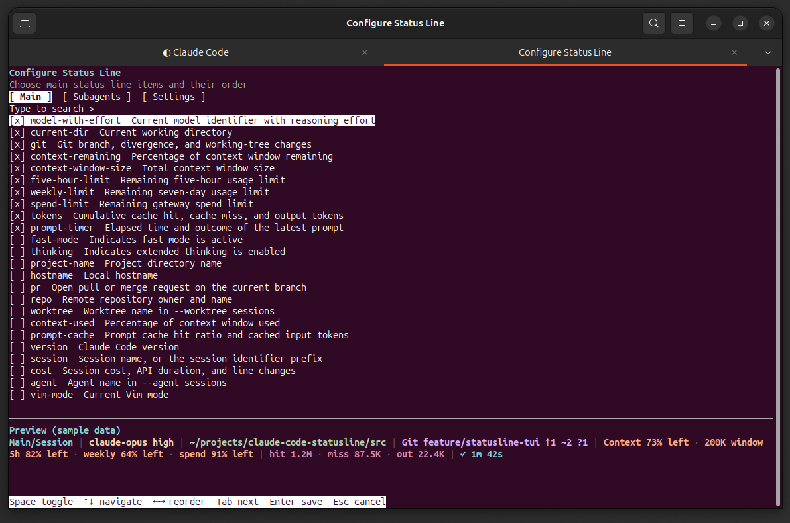
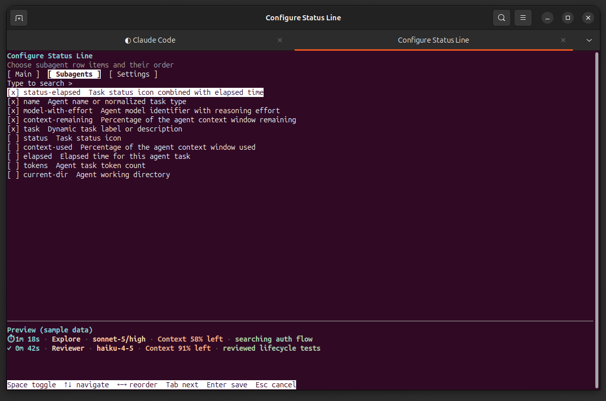
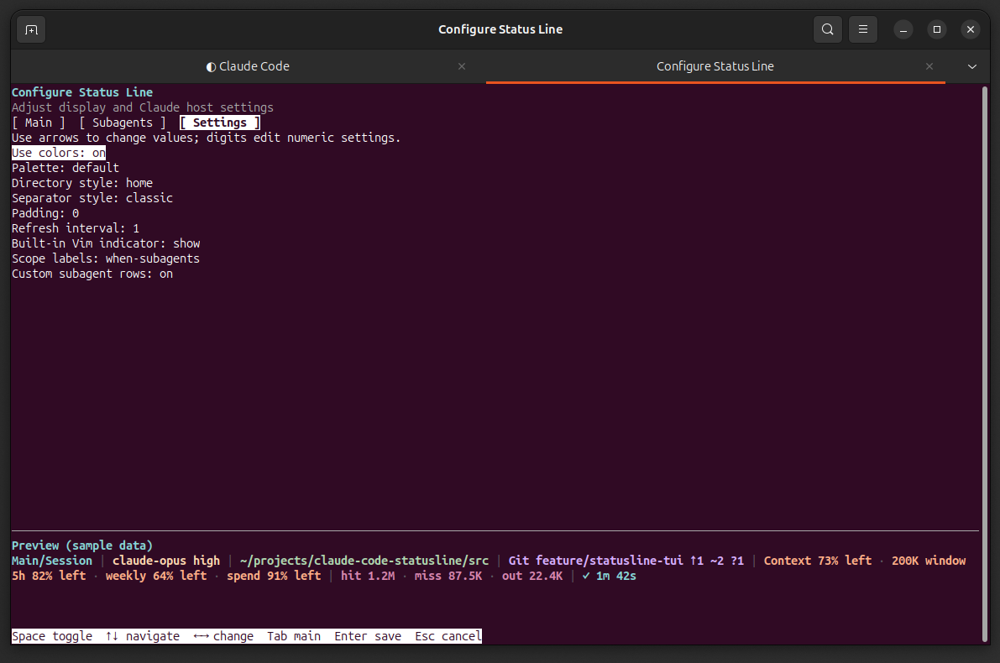
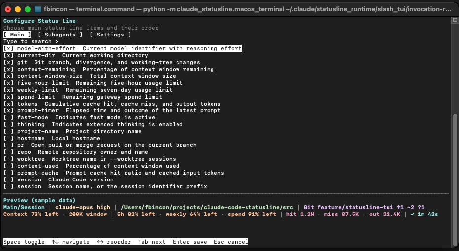
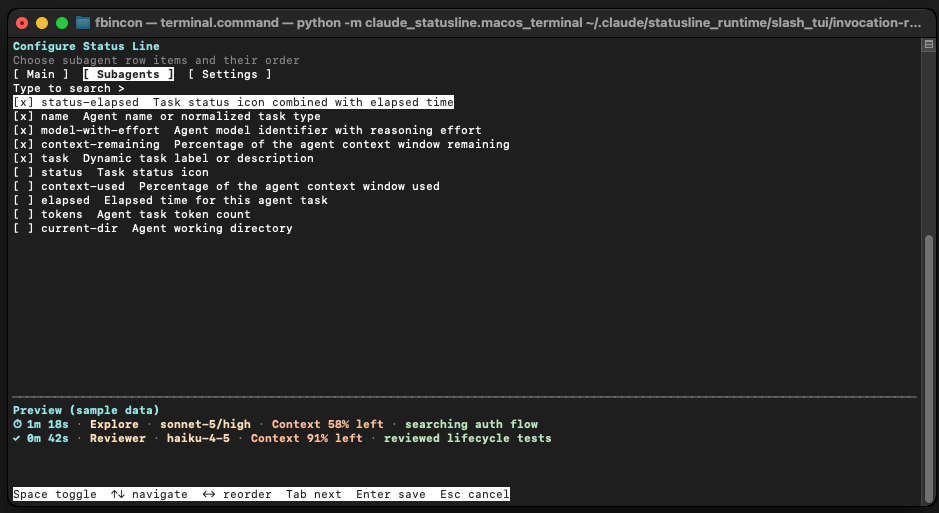
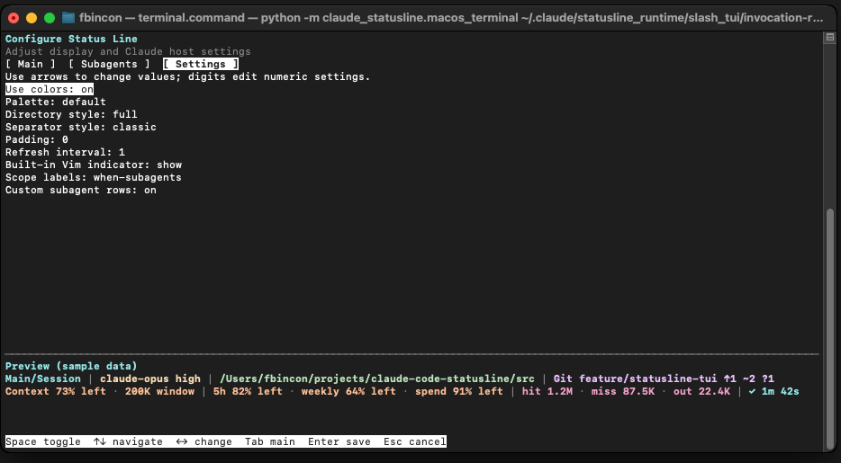
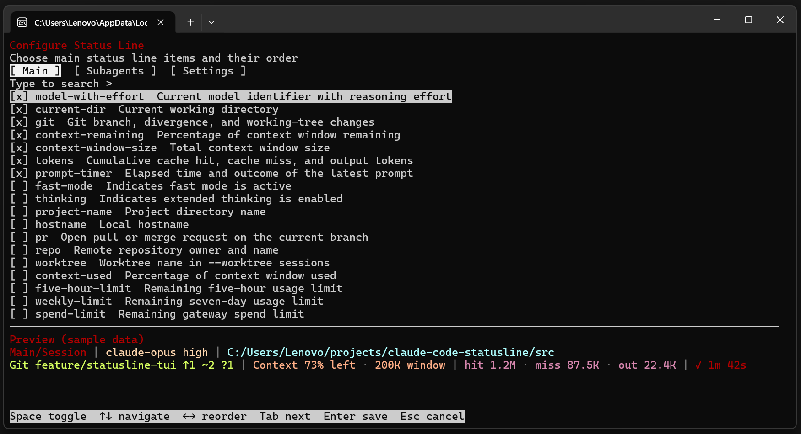
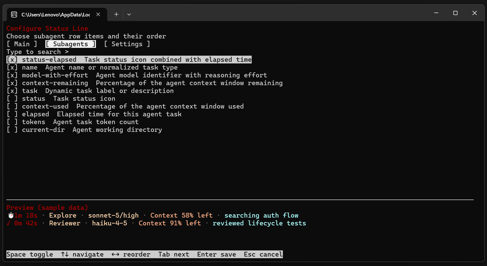
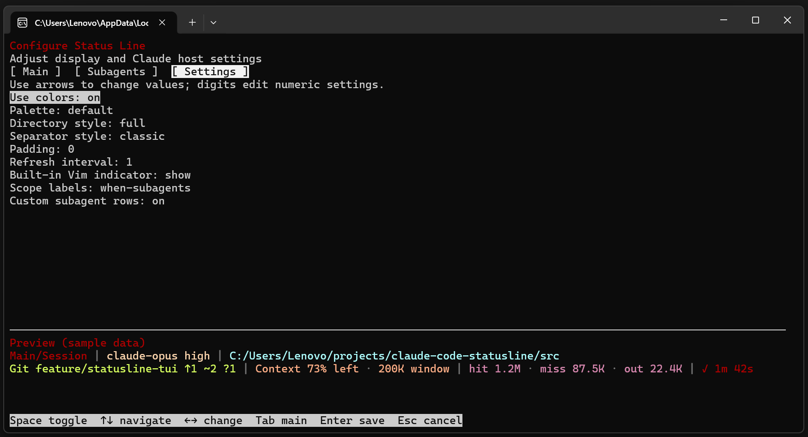

# Claude Code Statusline

[English](README.md) | **简体中文**

面向 Linux、WSL、Windows 和 macOS 的 Claude Code 状态栏，显示模型与思考强度（effort）、工作目录、Git、上下文、使用限额、token 和逐轮用时。支持子 Agent 独立状态行，可通过终端交互界面（TUI）、Claude Code 内的配置向导或命令行调整显示项、顺序和样式。

[快速安装](#快速安装) · [常用配置](#常用配置) · [完整使用指南](docs/USER_GUIDE.zh-CN.md) · [故障排查](docs/USER_GUIDE.zh-CN.md#故障排查) · [报告问题](https://github.com/fbincon/claude-code-statusline/issues)

## 界面预览

以下截图展示 Linux、macOS 和 Windows 的实际终端界面。主状态栏显示会话数据；配置界面底部的 Preview 使用固定样例数据。字体、颜色和字符宽度会随终端设置变化。

**Linux 主状态栏**


<details>
<summary>Linux：Main、Subagents 和 Settings 配置界面</summary>

**Main：选择主状态栏条目并调整顺序。**



**Subagents：配置子 Agent 行的条目与顺序。**



**Settings：调整颜色、目录样式、分隔符和刷新间隔等选项。**



</details>

<details>
<summary>macOS：Terminal.app 中的主状态栏与三页配置界面</summary>

**主状态栏**


**Main：主状态栏条目与样例预览**



**Subagents：子 Agent 行与样例预览**



**Settings：显示样式与宿主设置**



</details>

<details>
<summary>Windows：Windows Terminal 中的主状态栏与三页配置界面</summary>

**主状态栏**


**Main：主状态栏条目与样例预览**



**Subagents：子 Agent 行与样例预览**



**Settings：显示样式与宿主设置**



</details>

[截图文件索引](docs/images/README.zh-CN.md)

## 支持范围

- Linux 原生与 WSL：Python 3.10+。
- Windows 10/11 原生：CPython 3.10–3.14，x86/x64；自动安装 `windows-curses>=2.4.2`。
- macOS 14+：CPython 3.10–3.14，Intel / Apple Silicon。支持核心功能和独立 TUI；实验性配置入口优先使用 tmux popup，否则使用本地 Terminal.app。
- Claude Code CLI：2.1.205+ 支持子 Agent 独立状态行；2.1.258+ 支持带参数配置命令的本地执行及实验性 TUI 启动器。较旧或无法识别的版本仍可使用主状态栏和配置向导。
- Git 信息需要系统中存在 `git`。

当前稳定版为 [**v1.1.1**](https://github.com/fbincon/claude-code-statusline/releases/tag/v1.1.1)，以上平台使用同一个 wheel。Windows ARM64 原生 Python 暂不承诺；ARM 设备请使用 x64 Python 仿真。各功能的版本条件见[运行要求](docs/USER_GUIDE.zh-CN.md#运行要求)。

## 快速安装

先准备 Python、Claude Code CLI 和 [pipx](https://pipx.pypa.io/latest/how-to/install-pipx.html)。Linux / WSL / macOS / Windows 均可安装稳定版 v1.1.1。安装来源和文件校验方法见[使用指南](docs/USER_GUIDE.zh-CN.md#安装-python-包)。

### 从 Release 安装（推荐）

在 Bash / Zsh 或 PowerShell 中直接安装 [v1.1.1 wheel](https://github.com/fbincon/claude-code-statusline/releases/tag/v1.1.1)：

```text
pipx install "https://github.com/fbincon/claude-code-statusline/releases/download/v1.1.1/claude_code_statusline-1.1.1-py3-none-any.whl"
pipx ensurepath
```

也可以下载 wheel 后安装，具体步骤见[使用指南](docs/USER_GUIDE.zh-CN.md#安装-python-包)。

### 从固定标签源码安装

需要系统中存在 `git`，无需手动克隆或构建：

```text
pipx install "git+https://github.com/fbincon/claude-code-statusline.git@v1.1.1"
pipx ensurepath
```

### 从当前源码安装

需要跟踪开发改动时，可从默认分支安装当前源码（需要 Git，Bash / Zsh / PowerShell 通用）。`main` 会随开发更新，需要固定版本时使用上面的 Release 或标签：

```text
pipx install "git+https://github.com/fbincon/claude-code-statusline.git@main"
pipx ensurepath
```

已有本地源码时，可在项目根目录执行 `pipx install .`。自行构建 wheel 的步骤见[从源码构建与安装](docs/USER_GUIDE.zh-CN.md#从源码构建与安装)；macOS 终端要求见[macOS 安装说明](docs/USER_GUIDE.zh-CN.md#macos-安装与验证边界)。

### 接入 Claude Code

完成包安装后，**重新打开终端**，让 `pipx ensurepath` 设置的 `PATH` 生效。先确认 `--version` 显示 `claude-statusline 1.1.1`，再接入 Claude Code。

Linux / WSL / macOS（Bash / Zsh）：

```bash
claude-statusline --version
claude-statusline install --dry-run
claude-statusline install
claude-statusline doctor
```

Windows（PowerShell）：

```powershell
claude-statusline.exe --version
claude-statusline.exe install --dry-run
claude-statusline.exe install
claude-statusline.exe doctor
```

`pipx install` 安装 Python 包，`claude-statusline install` 将状态栏和配置入口接入 Claude Code。若已有其他工具的状态栏或同名 skill，安装器会报告冲突；需要接管时参见[冲突处理](docs/USER_GUIDE.zh-CN.md#处理已有-statusline-或同名-skill)。

## 常用配置

安装后，在终端运行 `claude-statusline configure`；Windows 使用 `claude-statusline.exe configure`。TUI 在当前终端打开，最小尺寸为 `64×18`，支持选择条目、排序和样例预览。非数字编辑状态下，Enter 保存全部修改，Esc 取消；Ctrl+C 中断且不保存。

| 入口 | 用途 |
| --- | --- |
| `claude-statusline configure` | 使用 TUI 交互调整主栏、子 Agent 行和样式 |
| Claude Code 内的 `/statusline-config` | 使用问答向导配置，或带参数执行配置命令 |
| `claude-statusline config ...` | 在终端查看配置、精确排序或用于脚本 |
| 实验性 `/statusline-configure` | 从 Claude Code 启动外部终端中的 TUI；默认关闭，见[启用说明](docs/USER_GUIDE.zh-CN.md#实验入口-statusline-configure) |

例如，在 Linux / WSL / macOS 中设置精简状态栏：

```bash
claude-statusline config set-items model-with-effort current-dir git context-remaining prompt-timer
claude-statusline config set directory-style home
claude-statusline config show
```

Windows 将上述命令名替换为 `claude-statusline.exe`。`set-items` 会替换整个启用集合；需要增量调整时使用 `enable`、`disable`。更多示例见[常用配置配方](docs/USER_GUIDE.zh-CN.md#常用配置配方)。

配置按用户生效。显示偏好保存在 Claude 配置目录中的 `claude-statusline.json`；配置目录、默认值及历史格式兼容见[配置文件](docs/USER_GUIDE.zh-CN.md#配置文件)。

## 升级与卸载

升级到 v1.1.1 时，替换 Python 包（Bash / Zsh / PowerShell 通用）：

```text
pipx install --force "https://github.com/fbincon/claude-code-statusline/releases/download/v1.1.1/claude_code_statusline-1.1.1-py3-none-any.whl"
```

随后重新运行 `claude-statusline install` 和 `claude-statusline doctor`；Windows 使用 `claude-statusline.exe`。升级保留 Claude 配置目录中的显示偏好和运行状态。本地 wheel、源码安装及版本兼容的处理见[升级指南](docs/USER_GUIDE.zh-CN.md#升级)。

卸载时先移除 Claude Code 接入，再删除 Python 包。

Linux / WSL / macOS：

```bash
claude-statusline uninstall --dry-run
claude-statusline uninstall
pipx uninstall claude-code-statusline
```

Windows：

```powershell
claude-statusline.exe uninstall --dry-run
claude-statusline.exe uninstall
pipx uninstall claude-code-statusline
```

卸载会保留显示偏好、缓存、备份和实验功能偏好，详情见[卸载说明](docs/USER_GUIDE.zh-CN.md#卸载)。


## 原生编辑器预览

[原生界面画面及来源](docs/images/README.zh-CN.md#原生编辑器画面)。

[v1.2.0a1 预览](https://github.com/fbincon/claude-code-statusline/releases/tag/v1.2.0a1) 在 wheel 中包含匹配的原生 Mod。上面的稳定安装仍为 v1.1.1；以下命令需要预览包，已发布的 v1.1.1 CLI 不提供它们。

```bash
pipx install --force "https://github.com/fbincon/claude-code-statusline/releases/download/v1.2.0a1/claude_code_statusline-1.2.0a1-py3-none-any.whl"
claude-statusline install --native-editor
claude-statusline doctor
```

在受信任终端中重启 Claude Code 2.1.287+，运行 `/statusline-configure` 或别名 `/statusline-configure-native`。Main/Subagents 提供选择、排序和样例预览；Settings 提供现有九项工具设置，以及独立的 theme/verbose 宿主偏好。`1/2/3` 切页，Tab/Enter 操作原生控件，`s` 保存工具配置并保持面板打开，`a` 应用宿主偏好，Esc/`q` 丢弃待保存修改；Esc 先退出输入字段。参见[原生编辑器行为](docs/development/native.zh-CN.md)。

预览必须显式启用。`install --no-native-editor` 持久保存禁用偏好并撤下所属原生接入；仅在实验入口偏好已启用时恢复兼容 `/statusline-configure` 启动器。向导 `/statusline-config` 和独立 `claude-statusline configure` 保留。安装失败保留兼容配置并报告实际状态，核对 doctor 后再重试。Linux、Windows、macOS 的真实终端交互另设真人验收门槛，平台安装自动检查不替代它。

## 文档与帮助

- [使用指南](docs/USER_GUIDE.zh-CN.md)：完整安装步骤、TUI、CLI、显示项和配置参考。
- [诊断与故障排查](docs/USER_GUIDE.zh-CN.md#故障排查)：先运行 `doctor`，再按具体症状排查。
- [开发与测试](docs/USER_GUIDE.zh-CN.md#附录开发与测试) · [发布指南](docs/RELEASING.zh-CN.md) · [变更记录](CHANGELOG.zh-CN.md)。
- [项目架构](docs/development/architecture.zh-CN.md) · [验证与验收](docs/development/testing.zh-CN.md) · [计时指标与证据](docs/development/timer.zh-CN.md)。
- [原生配置编辑器](docs/development/native.zh-CN.md)：源码提供三页、revision 保存保护及独立宿主偏好；三平台编辑器验收仍待完成。
- [共享配置协议](docs/development/contracts.zh-CN.md)：源码开发使用的项目目录和内部 JSON describe/read/preview/apply 契约。
- [GitHub Issues](https://github.com/fbincon/claude-code-statusline/issues)：报告问题时请提供系统、Python/Claude Code/本工具版本、复现步骤，以及去除私人路径和会话内容后的诊断输出。

## 许可证

本项目采用 [MIT 许可证](LICENSE)。Copyright (c) 2026 [fbincon](https://github.com/fbincon)。
