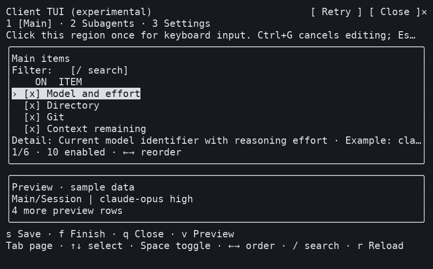
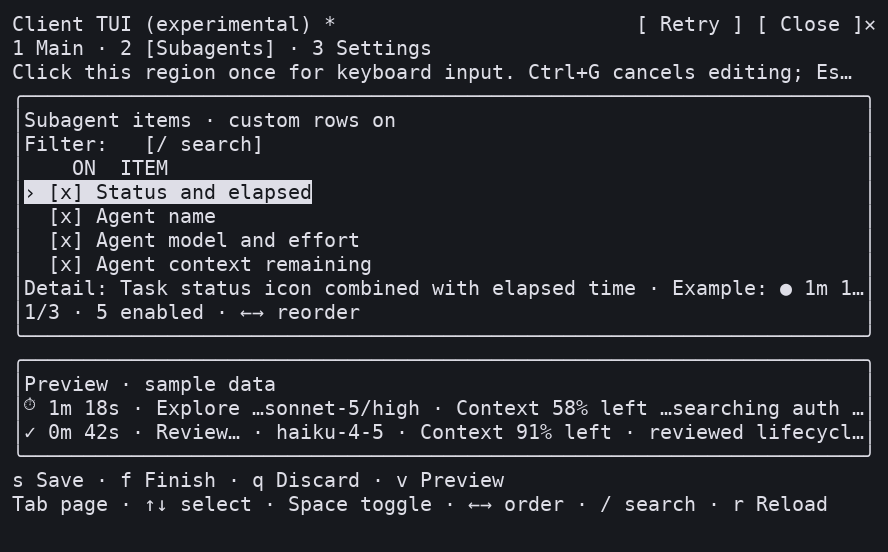
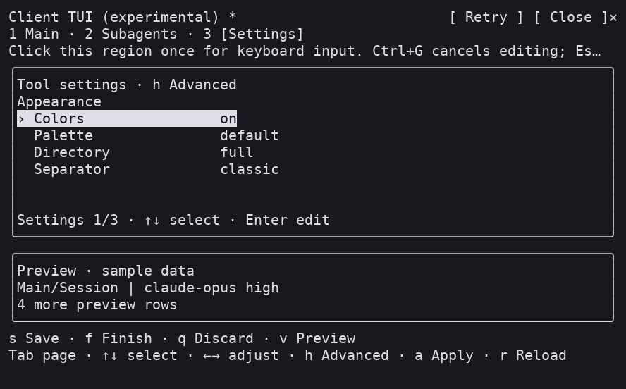

# Claude Code Statusline

[English](README.md) | **简体中文**

面向 Linux、WSL、Windows 和 macOS 的 Claude Code 状态栏，显示模型与思考强度（effort）、工作目录、Git、上下文、使用限额、token 和逐轮用时。支持子 Agent 独立状态行，可通过终端交互界面（TUI）、Claude Code 内的配置向导或命令行调整显示项、顺序和样式。

[快速安装](#快速安装) · [常用配置](#常用配置) · [完整使用指南](docs/USER_GUIDE.zh-CN.md) · [故障排查](docs/USER_GUIDE.zh-CN.md#故障排查) · [报告问题](https://github.com/fbincon/claude-code-statusline/issues)

## 界面预览

以下截图展示 Linux、macOS 和 Windows 的实际终端界面。主状态栏显示会话数据；配置界面底部的 Preview 使用固定样例数据。字体、颜色和字符宽度会随终端设置变化。

**Linux 主状态栏**


<details>
<summary>Linux：Main、Subagents 和 Settings 配置界面</summary>

**Main：选择主状态栏条目并调整顺序。**


**Subagents：配置子 Agent 行的条目与顺序。**


**Settings：调整颜色、目录样式、分隔符和刷新间隔等选项。**


</details>

<details>
<summary>macOS：Terminal.app 中的主状态栏与三页配置界面</summary>

**主状态栏**


**Main：主状态栏条目与样例预览**


**Subagents：子 Agent 行与样例预览**


**Settings：显示样式与宿主设置**


</details>

<details>
<summary>Windows：Windows Terminal 中的主状态栏与三页配置界面</summary>

**主状态栏**


**Main：主状态栏条目与样例预览**


**Subagents：子 Agent 行与样例预览**


**Settings：显示样式与宿主设置**


</details>

[截图文件索引](docs/images/README.zh-CN.md)

<details>
<summary>会话内 Client：Main、Subagents、Settings（a2 画面，正式版沿用同一交互）</summary>







[画面来源及真人验收记录](docs/images/README.zh-CN.md#v130a2-client-画面)。

</details>


## 支持范围

- Linux 原生与 WSL：Python 3.10+。
- Windows 10/11 原生：CPython 3.10–3.14，x86/x64；自动安装 `windows-curses>=2.4.2`。ARM 设备使用 x64 Python 仿真。
- macOS 14+：CPython 3.10–3.14，Intel / Apple Silicon。
- Claude Code 2.1.205+ 支持子 Agent 独立状态行；2.1.258+ 支持外部 TUI 入口与带参数配置命令的本地执行；2.1.287+ 支持会话内 Client。
- 不兼容或无法识别的宿主暂挂对应入口；基础状态栏、独立终端 TUI、向导和 CLI 继续可用。Git 信息需要系统中存在 `git`。

当前稳定版为 [**v1.3.0**](https://github.com/fbincon/claude-code-statusline/releases/tag/v1.3.0)，以上平台共用同一个 wheel。维护者已确认 v1.3.0a2 的 Linux、Windows、macOS 真人验收通过；正式版沿用其 Client 交互。完整边界见[运行要求](docs/USER_GUIDE.zh-CN.md#运行要求)。

## 快速安装

先准备 Python、Claude Code CLI 和 [pipx](https://pipx.pypa.io/latest/how-to/install-pipx.html)。下载校验、各平台步骤和源码构建见[使用指南](docs/USER_GUIDE.zh-CN.md#安装-python-包)。

### 从 Release 安装（推荐）

Bash / Zsh / PowerShell 通用：

```text
pipx install "https://github.com/fbincon/claude-code-statusline/releases/download/v1.3.0/claude_code_statusline-1.3.0-py3-none-any.whl"
pipx ensurepath
```

### 从固定标签源码安装

需要 Git：

```text
pipx install "git+https://github.com/fbincon/claude-code-statusline.git@v1.3.0"
pipx ensurepath
```

### 从当前源码安装

`main` 随开发变化；本地检出在项目根目录执行 `pipx install .`：

```text
pipx install "git+https://github.com/fbincon/claude-code-statusline.git@main"
pipx ensurepath
```

### 接入 Claude Code

重新打开终端让 PATH 生效，确认版本为 `claude-statusline 1.3.0`：

```text
claude-statusline --version
claude-statusline install --dry-run
claude-statusline install
claude-statusline doctor
```

Windows 使用 `claude-statusline.exe`。包安装与 Claude 接入分为两步；接入后在受信任终端重启 Claude Code 加载插件和命令。正式版两个入口默认启用，但已有明确关闭偏好优先；宿主不兼容时分别暂挂。安装不会打开配置面板或外部终端。第三方资源按所属入口检查冲突，见[冲突处理](docs/USER_GUIDE.zh-CN.md#处理已有-statusline-或同名-skill)。

## 常用配置

| 入口 | 用途 |
| --- | --- |
| `/statusline-configure-native` | 同一 Claude Code session 内的 Client TUI；默认启用，需 2.1.287+；见[原生配置编辑器](docs/USER_GUIDE.zh-CN.md#原生配置编辑器) |
| `/statusline-configure` | 外部终端承载现有 TUI；默认启用，需 2.1.258+；见[外部终端入口](docs/USER_GUIDE.zh-CN.md#外部终端入口-statusline-configure) |
| `claude-statusline configure` | 当前独立终端中的完整 TUI；Windows 使用 `claude-statusline.exe configure` |
| `/statusline-config` | Claude 问答向导；带参数时按宿主能力本地执行或进入模型回合 |
| `claude-statusline config ...` | 检查配置、设置精确顺序或运行脚本 |

<a id="v130a2外部-tui-与会话内-client"></a>

### 原生配置编辑器

执行 `/statusline-configure-native` 后**先点击 Client 区域一次**，再使用 Tab 切页、方向键选择/排序、Space 勾选、`/` 搜索、Ctrl+G 取消输入。`s` 保存留页，`f` 保存后退出，`q` 丢弃退出；Esc 由宿主处理。Settings 分为外观、刷新与显示行为、Claude 高级偏好；高级偏好独立 Apply。最小面板正文为 32×12。

### 外部与独立终端 TUI

`/statusline-configure` 沿用 Linux tmux / GNOME Terminal、macOS tmux / Terminal.app 和 Windows 系统新控制台路径。`claude-statusline configure` 直接使用当前终端；最低 64×18。非数值编辑时 Enter 保存、Esc 取消；Ctrl+C 中断且不保存。

两个编辑器可同时打开，旧草稿的保存会被 revision 校验拒绝，避免覆盖新配置。Native 重复打开保留草稿；冲突时 `r` 明确丢弃并重载，保存结果不明时先 `k` 核对。

默认安装、四种安装组合和版本降级见[编辑器安装组合与兼容性](docs/USER_GUIDE.zh-CN.md#编辑器安装组合与兼容性)。分别关闭：

```text
claude-statusline install --no-native-editor
claude-statusline install --no-experimental-slash-tui
```

历史参数 `--experimental-slash-tui` 继续负责外部入口，与 `--native-editor` 相互独立。示例精简主栏：

```text
claude-statusline config set-items model-with-effort current-dir git context-remaining prompt-timer
claude-statusline config set directory-style home
claude-statusline config show
```

配置按用户生效；`set-items` 替换全部启用项，`enable` / `disable` 用于增量修改。更多示例见[配置配方](docs/USER_GUIDE.zh-CN.md#常用配置配方)。

## 升级与卸载

升级到 v1.3.0：

```text
pipx install --force "https://github.com/fbincon/claude-code-statusline/releases/download/v1.3.0/claude_code_statusline-1.3.0-py3-none-any.whl"
claude-statusline install
claude-statusline doctor
```

Windows 使用 `claude-statusline.exe`；随后重启 Claude Code。保留显示配置、运行状态和已保存的独立启用偏好。旧版外部禁用操作曾删除偏好文件：没有记录时遵循正式版默认启用，需要保持关闭时重新传入 `--no-experimental-slash-tui`。详见[升级指南](docs/USER_GUIDE.zh-CN.md#升级)。

先移除 Claude 接入，再卸载 Python 包：

```text
claude-statusline uninstall --dry-run
claude-statusline uninstall
pipx uninstall claude-code-statusline
```

显示配置、偏好、缓存与备份保留，见[卸载](docs/USER_GUIDE.zh-CN.md#卸载)。

## 文档与帮助

- [使用指南](docs/USER_GUIDE.zh-CN.md) · [故障排查](docs/USER_GUIDE.zh-CN.md#故障排查) · [变更记录](CHANGELOG.zh-CN.md)。
- [原生编辑器开发与验收](docs/development/native.zh-CN.md) · [架构](docs/development/architecture.zh-CN.md) · [共享协议](docs/development/contracts.zh-CN.md)。
- [测试与验收](docs/development/testing.zh-CN.md) · [计时指标](docs/development/timer.zh-CN.md) · [发布指南](docs/RELEASING.zh-CN.md)。
- [GitHub Issues](https://github.com/fbincon/claude-code-statusline/issues)：附系统与版本、复现步骤及诊断结果，移除私有路径和会话内容。

## 许可证

[MIT License](LICENSE)，Copyright (c) 2026 [fbincon](https://github.com/fbincon)。
