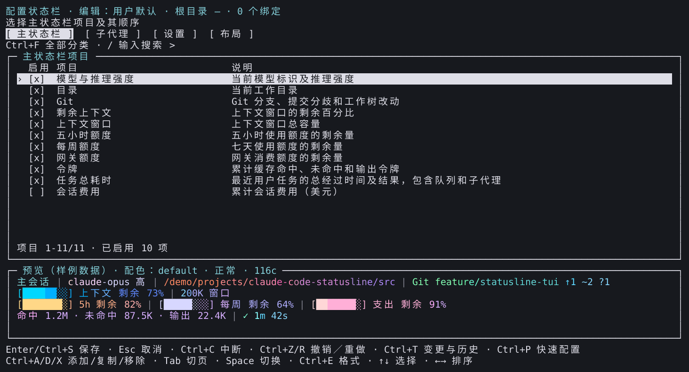

# Claude Code Statusline

[English](README.md) | **简体中文**

[](https://github.com/fbincon/claude-code-statusline/actions/workflows/ci.yml)
[](https://www.npmjs.com/package/@fbincon/claude-code-statusline) · [](LICENSE)

适用于 Linux、WSL、Windows 和 macOS 的可配置 Claude Code 状态栏。一眼查看模型与推理强度、项目、Git、上下文、用量和任务计时；通过会话内编辑器、终端编辑器或 CLI 配置主栏与独立的子代理行。

[使用演示](docs/SHOWCASE.zh-CN.md) · [快速安装](#快速安装) · [常用配置](#常用配置) · [使用指南](docs/USER_GUIDE.zh-CN.md) · [故障排查](docs/USER_GUIDE.zh-CN.md#故障排查)

<a id="v161外部-tui-栏目层级"></a>
<a id="正式-v150-的-phase-4-功能"></a>
<a id="正式-v160-的-phase-5-功能"></a>

## 功能概览

- **选择所需信息：** 65 个主栏指标、15 个子代理指标，以及文本和弹性留白；可跨十二种语言搜索名称、ID 与说明。[指标定义](docs/DISPLAY_ITEMS.zh-CN.md)。
- **组合清晰布局：** 独立组件副本、联动分组、显式行、左右布局、条件显示、颜色、渐变和自适应百分比指标。[组件与布局](docs/COMPOSITION.zh-CN.md) · [外观](docs/APPEARANCE.zh-CN.md)。
- **从方案开始：** 八套完整显示方案与六种原有预设均可继续编辑；支持命名方案、项目绑定及选择性样式／整组复用。[完整方案](docs/SCHEMES.zh-CN.md) · [项目绑定](docs/PROFILES.zh-CN.md)。
- **先审阅再保存：** 样例场景、宽度预览、导入差异、共享撤销／重做和当前文件比较帮助核对草稿。[草稿历史与复用](docs/DRAFT_HISTORY.zh-CN.md)。
- **跟踪任务和代理：** 区分会话与单代理指标，任务计时覆盖子代理工作及主代理收尾，并提供可搜索的任务证据查看器。[任务详情](docs/TASK_DETAILS.zh-CN.md)。
- **接入明确的数据源：** 本地 JSON、GitHub 检查与命令值，分别审阅启用、刷新及可选链接。[扩展指南](docs/EXTENSIONS.zh-CN.md)。
- **分别选择界面与输出语言：** English、简体中文、繁體中文（台灣）、繁體中文（香港）、日本語、한국어、Español、Français、Deutsch、Português (Brasil)、Русский 和 Bahasa Indonesia。
- **诊断与恢复：** 检查明确提供的输入、审阅软件包变更，并显式恢复兼容配置备份。[输入诊断](docs/DIAGNOSTICS.zh-CN.md) · [版本管理](docs/PACKAGE_MANAGEMENT.zh-CN.md)。

渲染读取 Claude Code 输入和本地状态，不发网络请求或使用模型 token。可选来源刷新单独执行；问答向导使用 Claude 模型回合。缺失观测不会被当作零。

组件可选不代表数据一定可用。宿主字段取决于 Claude Code 提供的输入；Git 指标需要本地 Git 和有效仓库；子代理行需要兼容宿主及任务数据。原生计时／实时指标需要兼容且明确启用的采集。GitHub 和命令值需要注册、审阅、启用并绑定来源，再成功刷新。[可用性与新鲜度](docs/DISPLAY_ITEMS.zh-CN.md#可用性与新鲜度) · [来源配置](docs/EXTENSIONS.zh-CN.md)。

## 界面预览

日常开发场景使用经典分隔符与不同的前景渐变。[复现使用演示](docs/SHOWCASE.zh-CN.md) · [素材来源](docs/images/showcase/README.zh-CN.md)。




动图先复制一个指标，再演示撤销、重做、保存和重新打开编辑器。这组演示基于 v3.16.0；后续版本可能调整交互细节，当前控件以[使用指南](docs/USER_GUIDE.zh-CN.md)为准。

## 支持范围

| 平台 | 支持环境 |
| --- | --- |
| Linux / WSL | Node 22.x 或 24.x，x64 |
| Windows 10/11 | Node 22.x 或 24.x，x64 |
| macOS 14+ | Node 22.x 或 24.x，Intel / Apple Silicon |

Windows ARM 设备使用模拟 x64 Node；原生 Windows ARM64 与 32 位运行时不在支持范围。Git 字段需要 Git。Claude Code 条件按功能区分：子代理行 2.1.205+（逐任务 effort 2.1.214+），本地 slash 参数／外部入口 2.1.258+，会话内编辑器 2.1.287+，原生计时／实时指标 2.1.289+。[运行要求与限制](docs/USER_GUIDE.zh-CN.md#运行要求)。

<a id="从-release-安装推荐"></a>
<a id="从固定标签源码安装"></a>
<a id="从当前源码安装"></a>

## 快速安装

准备 Node 22.x 或 24.x、npm 和 Claude Code CLI。安装包包含受支持的原生依赖，无需 Python 或编译器。

### 安装软件包

交互终端中的 `npx @fbincon/claude-code-statusline` 会先审阅持久安装，再打开设置向导。也可以明确安装软件包：

```text
npm install --global --ignore-scripts @fbincon/claude-code-statusline
```

### 接入 Claude Code

确认 npm 命令目录位于 PATH 后运行：

```text
claude-statusline --version
claude-statusline setup --dry-run
claude-statusline setup
claude-statusline doctor
```

Windows 使用 `claude-statusline.cmd`，或用 Node 调用安装后的 JavaScript 入口。接入后在受信任终端重启 Claude Code。软件包安装、显示保存与 Claude 接入是不同阶段；后续阶段失败时，向导会报告已完成部分。

兼容宿主上两个编辑器默认启用，并保留已保存选择。原生计时和高级实时指标需明确启用。参见[首次设置](docs/SETUP.zh-CN.md)、[离线／固定版本安装](docs/USER_GUIDE.zh-CN.md#安装与接入)、[冲突处理](docs/USER_GUIDE.zh-CN.md#处理已有-statusline-或同名-skill)和 [Python 迁移](docs/USER_GUIDE.zh-CN.md#从-python-迁移)。

## 常用配置

<a id="v130a2外部-tui-与会话内-client"></a>

| 入口 | 用途 | 指南 |
| --- | --- | --- |
| <a id="会话内-tui"></a><a id="原生配置编辑器"></a>`/statusline-configure-native` | 在当前 Claude 会话内编辑 | [会话内编辑器](docs/USER_GUIDE.zh-CN.md#原生配置编辑器) |
| <a id="外部-tui"></a>`/statusline-configure` | 从 Claude Code 启动受支持的外部终端 | [外部终端入口](docs/USER_GUIDE.zh-CN.md#外部终端入口-statusline-configure) |
| <a id="外部与独立终端-tui"></a>`claude-statusline configure` | 在当前终端编辑，包括 SSH | [独立终端编辑器](docs/USER_GUIDE.zh-CN.md#独立交互式-tui) |
| `/statusline-config` | 使用 Claude 问答向导，或在本地执行受支持的带参数命令 | [问答向导](docs/USER_GUIDE.zh-CN.md#statusline-config-问答向导) |
| `claude-statusline config ...` | 检查设置或通过脚本指定准确值 | [CLI 配置配方](docs/USER_GUIDE.zh-CN.md#常用配置配方) |

在会话内编辑器使用键盘前，先单击 Client 区域。在任一编辑器按 **Ctrl+P** 打开快速配置，选择方案并预览草稿。保存会将草稿应用到当前显示的用户、方案或项目。[快速配置](docs/USER_GUIDE.zh-CN.md#快速配置文本编辑与说明) · [全部方案](docs/SCHEMES.zh-CN.md)。

### 语言设置

<a id="界面语言"></a>

设置共享界面偏好，或使用 `--language` 覆盖单次调用。

```text
claude-statusline config language set zh-CN
claude-statusline --language en configure
```

界面偏好即时保存，取消显示修改后仍保留。[界面语言](docs/USER_GUIDE.zh-CN.md#界面语言)。

<a id="状态栏语言"></a>

单独设置状态栏输出语言。

```text
claude-statusline config set statusline-language zh-CN
```

编辑器使用草稿中的语言预览。保存显示草稿后，该语言才会应用到主栏和子代理行。[状态栏语言](docs/USER_GUIDE.zh-CN.md#状态栏语言)。

### 从内置方案开始

使用日常开发方案和经典分隔符。

```text
claude-statusline config preset daily-development --dry-run
claude-statusline config preset daily-development
claude-statusline config set separator-style classic
```

先运行预演，查看应用预设会替换哪些显示选择和布局。

<a id="升级到-v161"></a>

## 升级与卸载

审阅并执行软件包变更，然后重启 Claude Code：

```text
claude-statusline update --check
claude-statusline update
claude-statusline doctor
```

[版本管理](docs/PACKAGE_MANAGEMENT.zh-CN.md)说明精确版本、prefix、回退及独立的配置恢复。卸载软件包前先移除 Claude 接入：

```text
claude-statusline uninstall --dry-run
claude-statusline uninstall
npm uninstall --global @fbincon/claude-code-statusline
```

显示设置与备份保留。[卸载说明](docs/USER_GUIDE.zh-CN.md#卸载)。

## 项目结构

TypeScript workspace 分为纯规则（`packages/core`）、平台副作用（`packages/platform`）、应用服务（`packages/cli`）和终端编辑器（`packages/tui`）。`mods` 包含官方宿主接入，`tools` 包含生成、打包和验收工具，`archive/python` 保留冻结的历史实现。[架构](docs/development/architecture.zh-CN.md) · [开发环境](docs/development/README.zh-CN.md)。

## 文档与帮助

[文档中心](docs/README.zh-CN.md) · [使用指南](docs/USER_GUIDE.zh-CN.md) · [CLI 参考](docs/reference/cli.zh-CN.md) · [开发指南](docs/development/README.zh-CN.md) · [发布说明](docs/releases/README.zh-CN.md) · [变更日志](CHANGELOG.zh-CN.md)

[GitHub Issues](https://github.com/fbincon/claude-code-statusline/issues)接受可复现缺陷、问题及功能建议。请提供版本、步骤和相关诊断，并移除私人路径及会话内容。

## 贡献与安全

开发、翻译及反馈参见[贡献指南](CONTRIBUTING.zh-CN.md)。潜在漏洞通过[安全政策](SECURITY.zh-CN.md)私下报告。参与本项目即表示同意遵守[行为准则](CODE_OF_CONDUCT.zh-CN.md)。

## 许可证

[MIT License](LICENSE)，Copyright (c) 2026 [fbincon](https://github.com/fbincon)。

内置 Unicode 数据保留 [Unicode License v3](tools/unicode/UNICODE-LICENSE.txt) 和 [wcwidth MIT 声明](tools/unicode/WCWIDTH-LICENSE.txt)。
