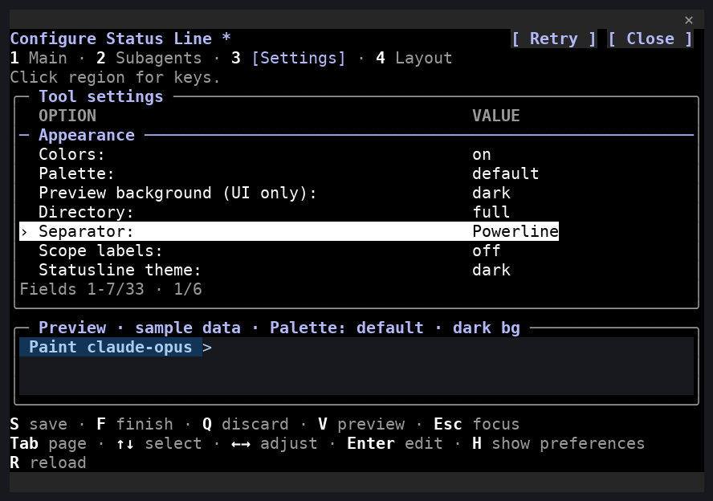
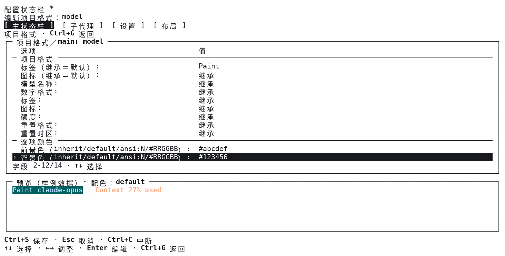

# 条件显示、颜色与 Powerline

[English](APPEARANCE.md) | **简体中文**

在“设置”页选择状态栏主题和分隔样式；按 Ctrl+E 打开显示项详情，编辑颜色及适用的条件规则。两个编辑器使用固定样例预览未保存草稿，保存后才生效，取消保留原配置。这些设置独立于 Claude 宿主主题、界面语言和原生预览背景。

## 条件显示

逐项设置不会自动启用显示项。请通过勾选或 `config enable context-used` 将它加入实际显示。

默认 `always` 不增加过滤，显示项仍沿用原来的数据缺失处理。条件在格式化和布局之前使用原始观测判断，因此百分比四舍五入、中文标签和数字缩写不会改变结果。隐藏后不残留分隔符或空行。

| 规则 | 支持的显示项 | 含义 |
| --- | --- | --- |
| `git-dirty` | 主状态栏 `git`、`git-changes` | 暂存、未暂存、冲突和未跟踪计数均确认是零时隐藏；复合 `git` 还要求领先／落后均为零且无上游丢失提示。Git 错误保留。 |
| `nonzero` | 主状态栏 `active-agents`、`task-progress` | 仅在完整有效观测确认零代理或空列表时隐藏；非空但全部完成的任务列表仍显示。 |
| `used-at-least` | 主状态栏 `context-used`、`context-remaining`、`five-hour-limit`、`weekly-limit`、`spend-limit`；子代理 `context-used`、`context-remaining` | 原始**已用**比例达到 `visibility-threshold` 时显示；阈值为 0–100 整数，初始值 70，不受显示“已用／剩余”的格式影响。 |

未知、过期、部分或不可用观测保留原来的表现，不视为零；到期额度仍沿用原来的省略规则。条件不会启用实时采集或增加采集器。可见性阈值与警告／危险颜色阈值相互独立。

```text
claude-statusline config item main git visibility git-dirty
claude-statusline config item main active-agents visibility nonzero
claude-statusline config item main task-progress visibility nonzero
claude-statusline config item main context-used visibility-threshold 80
claude-statusline config item main context-used visibility used-at-least
claude-statusline config item subagent context-remaining visibility used-at-least
claude-statusline config item main git visibility always
```

## 主题与逐项颜色

主题保留项目选择、顺序、格式、布局和采集偏好，切换主题也保留逐项覆盖。四种主题 ID 为 `classic`（既有外观）、`dark`（深色）、`light`（浅色）和 `terminal`（终端 ANSI 色槽），分别提供普通显示和 Powerline 颜色角色。主题不会修改终端背景或安装字体。

```text
claude-statusline config set theme light
claude-statusline config item main model foreground '#205727'
claude-statusline config item main model background 'ansi:254'
claude-statusline config item subagent name foreground default
claude-statusline config item main model foreground inherit
claude-statusline config item main model background inherit
```

颜色支持 `inherit`、`default`、`ansi:N`（0–255）和六位 `#RRGGBB`；在 shell 中为十六进制颜色加引号。`inherit` 继承显示项的主题／语义色，`default` 明确恢复终端前景／背景，包括 Powerline 色块内部。JSON 用 `null` 保存继承，其余值为字符串；RGB 文本统一转成小写。

启用阈值变色时，警告／危险前景色覆盖逐项前景色，逐项背景保持。沿用 `threshold-colors`、`warning-threshold` 和 `critical-threshold` 控制这一行为。关闭颜色会同时关闭前景与背景；`palette ansi` 将自定义 RGB／扩展色量化为基础 ANSI 色槽，实际色槽颜色由终端决定。curses 继续适配 0／8／16／256 色能力，颜色对无法分配时回退到终端默认文字。

## 基础 Powerline

```text
claude-statusline config set separator-style powerline
claude-statusline config set powerline-glyph ascii
claude-statusline config set powerline-glyph powerline
claude-statusline config set separator-style classic
```

Powerline 默认关闭，开启后默认使用 `>`。选择 `powerline` 字形时，前一背景明确且相邻背景不同时使用 U+E0B0，其他边界使用 `>`。请自行选择支持该字形的字体，或恢复 `ascii`；无色输出使用 ASCII。

每个可见显示项形成一个色块，复合项目保留内部内容。左右各一格内边距及分隔字符计入宽度；窄的显式行／子代理行先减少装饰，再按优先级适配和完整字素裁剪。自动行按色块换行，过长色块仅在完整字素边界拆分。行尾恢复样式，默认背景不会泄漏到后续内容。原有自动／显式布局和逐项宽度设置继续适用。

## 配置兼容与恢复

显示 schema **7** 新增全局 `theme`／`powerline_glyph` 和逐项 `foreground`、`background`、`visibility`、`visibility_threshold`。编辑器协议 **9** 传输完整草稿；可移植封装版本 **1**、界面偏好 **1** 与运行协议 **2** 独立演进。

读取版本 1–6 时不改写文件，实际保存时先备份原始字节，再写入 schema 7。旧文件缺失的设置采用经典主题、ASCII 字形、继承颜色与 `always`。导入审阅包含新增字段，接受时仅替换草稿；未来 schema、非法颜色和不适用于该作用域显示项的规则会被拒绝。

降级前保存／导出当前配置，按[发布指南](RELEASING.zh-CN.md)的要求使用新版软件移除原生编辑器，安装旧版后恢复迁移前的兼容显示配置备份。不要只修改 schema 数字，也不要期望旧软件保留新字段。恢复操作见[用户指南](USER_GUIDE.zh-CN.md)。

## 实际终端捕获示例

下图由安装包的实际终端输出和固定样例数据重建；[图片索引](images/README.zh-CN.md#conditional-appearance-captures)记录来源。图片检查不代表真人平台验收。




