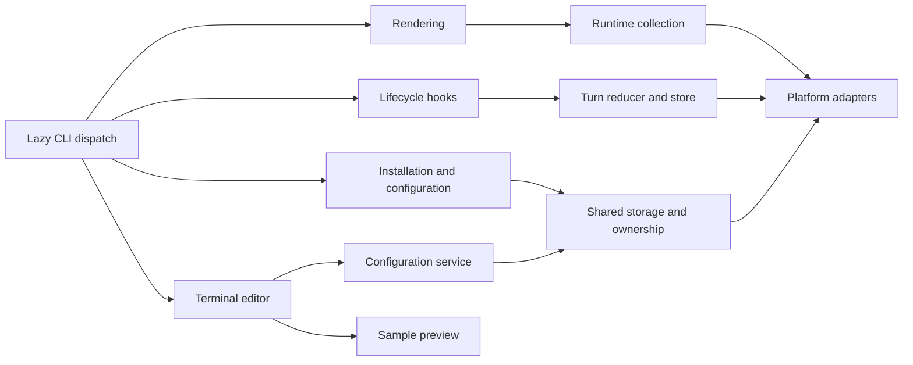

# Architecture and repository layout

**English** | [简体中文](architecture.zh-CN.md)

The Python package keeps the existing CLI, configuration formats and storage locations. Version 1.1.1 groups implementation by responsibility and retains lazy compatibility modules at the original Python paths.

```text
src/claude_statusline/
  cli.py, __main__.py, _version.py   CLI dispatch and version
  config/                           Display/features, host settings, models,
                                    shared storage, transactions and commands
  rendering/                        Formatting, palette, layout, items,
                                    timer, main/subagent output and preview
  runtime/                          Paths, caches, registry, transcript,
                                    usage, Git and prompt lifecycle
    turns/                          Pure records, locked storage and reducer
  integration/                      Ownership, capabilities, resources,
                                    installation plan/commit, doctor,
                                    hooks, launcher and result bridge
  ui/                               Models, draft editor, keys, drawing,
                                    terminal session and save/cancel lifecycle
  platforms/                        OS detection, files, processes, clocks
                                    and the Terminal.app adapter
  resources/                        Bundled configuration skill templates
  *.py                              Legacy compatibility entry points

tests/{config,rendering,runtime,integration,ui,platforms}/
tests/support.py                    Stable source locations for subprocess tests
tools/                              Validation and opt-in acceptance commands
docs/development/                   Architecture, testing and timer contracts
```

## Dependencies and boundaries

The bundled TypeScript Client editor lives in `mods/statusline-native`, split into a statically inspectable host entry, pure draft and host-row logic, strict protocol bridge, generated contracts, page rendering and official tests. Python remains the configuration/rendering owner. Source distributions retain Mod development files; `src/build_native.py` copies only runtime manifests/modules into the wheel, with a generated hash/version/protocol inventory. The installer owns a local directory marketplace and uses official plugin commands, separately from its compatibility file transaction. See [native integration](native.md).

`config.catalog` defines scoped items and derived legacy views. `ui.contracts` defines the generated frontend wire types, `ui.protocol` owns JSON describe/read/preview/apply transport and `rendering.spans` converts production samples to drawable output. `config.revisions` supplies the installation-aware semantic revision for locked reads and shared JSON/curses saves. Apply reuses the configuration service transaction and returns its committed snapshot. See [shared contracts](contracts.md).

Platform adapters provide locking, atomic writes, process identity and suspend-aware clocks. Runtime collectors use those adapters; renderers consume collected data and display configuration. UI drafts save through the configuration service. Installation and configuration share the same storage lock and ownership helpers, preserving rollback and semantic conflict detection.



`render`, `render-subagents` and `hook` keep terminal editors and launchers out of their startup paths. Package initializers do not eagerly import the subsystems. Optional frontend imports remain at their use sites; sample preview uses fixed data without transcript/Git collection or persistence.

The main renderer reads official JSON on stdin and writes formatted text. The subagent renderer writes NDJSON with the existing `id`/`content` protocol. Hooks remain silent and successful when input or state is unavailable. Administrative command errors continue to use stderr and existing exit codes.

## Compatibility and resources

Original modules such as `claude_statusline.statusline`, `turn_state`, `installer`, `interactive_config` and `_platform` forward attribute reads to canonical implementations. Function, exception and model identities are shared; there is no second lifecycle store or transaction implementation. Existing module execution paths, including `python -m claude_statusline.macos_terminal`, remain usable.

Tests patch the canonical module that owns a function or constant. Assigning private globals on a compatibility module is not a configuration interface; use the documented environment variables for runtime locations.

Resources continue to load through `importlib.resources` from `claude_statusline/resources`. Terminal child processes locate Python through the root package rather than assumptions about a moved adapter's parent directories.

## Persistence

Current display schema v3 evolves independently from feature schema v1, the schema-1 runtime mirror and lifecycle schema v3; historical display v1/v2 is normalized in memory until saving. Optional `duration_source` distinguishes frozen task elapsed time from eligible native calibration. Optional agent history, continuation prompt aliases and pending reports preserve a human task across host-generated result notifications. They remain bounded and do not change configuration formats. Timing transcript scan version 5 rechecks old caches without resetting cumulative usage.

Keep local ROADMAP files and raw acceptance records out of distributions. Release archives originate from a fixed verified commit; package inspection checks all canonical Python modules, compatibility entry points, resources, tests, tools and bilingual documents.

See [testing](testing.md), the [timer contract](timer.md) and the [release guide](../RELEASING.md).

## Native editor structure

The sole Mod source remains `mods/statusline-native`. Host APIs stay in `hooks/register.ts`, draft/numeric rules in `lib/editor/`, validated batches/keys/settings in `lib/client/`, and independent port snapshots in `lib/session.ts`. `ui/client/` owns Client input/drawing, `ui/components/` reusable sections, and `ui/layout.ts` the body budget. Tests mirror backend, client, editor, integration and UI.

The external `/statusline-configure` Python curses UI/platform launcher remains separate. Mod registers only `/statusline-configure-native`. Both can install/open together and use the same configuration service, revision checks and transaction lock. Client neither accesses files nor starts processes: cumulative ordered messages reach the host, copied snapshots isolate recursive host freezing, and sequence acknowledgements/deduplication plus epochs reject repeated/late input. Recursive packaging includes Client modules and excludes tests, host declarations, dependencies and raw validation reports.

config.editor_defaults shares stable editor defaults while each preference stays independent and explicit flags win. Installation, slash execution and doctor agree on external defaults: absence defaults on and explicit false persists off. Host thresholds are 2.1.258 external and 2.1.287 Client; unsupported/unknown versions suspend independently. Verified owned plugins suspend through locked, backed-up settings/owner transactions with rollback, without newer host APIs; only tool suspension automatically restores after compatibility returns.

## Independent display metrics

`rendering.metrics` owns strict numeric/context parsing, reset countdowns and session component formatting. The main render state shares a raw integer usage snapshot without additional I/O, captures one clock per refresh and memoizes live collectors; deterministic previews supply a fixed clock and sample values. Scoped catalog additions flow through generated contracts, both editors and the wizard without a schema/protocol change. See [display metric definitions](../DISPLAY_ITEMS.md).

Usage state keeps optional input/output observation flags alongside the existing integer accounting. Usage scan version 3 recovers these flags once for older sessions, including nested agents, without re-adding collapsed message IDs. Sparse cost-state snapshots update only observed counters; each counter keeps its own main/subagent delta anchor. The formatted collector interface and timer lifecycle remain compatible.

## Phase 4 configuration boundaries

Python `config.formatting`, `advanced`, `presets`, `transfer` and `editor_fields` own format rules, pure draft edits, preset expansion, portable files and shared form descriptors. Display schema v3 and protocol v2 evolve independently from editor enablement, runtime mirrors and lifecycle state. Both editors save a complete draft through the existing configuration service; legacy commands retain advanced fields and explicit reset restores defaults.

Curses `ui.forms` and Client `lib/client/forms.ts` expose scoped formats, Layout fitting and global settings from the canonical descriptors. Native hooks alone perform backend/file effects; `lib/preferences.ts` owns actual-row descriptions and supported controls, with separate Claude API application. Production and sample rendering share formatting and explicit layout; lazy Git/transcript collection is retained. No Phase 5 runtime indicators are added.

## Independent runtime collection

The opt-in `mods/statusline-runtime` is separate from the Client editor. Both Mods use explicit identities in the shared owned-plugin installer and resource inventory. `runtime/live/` owns the strict runtime protocol, per-session locks, atomic observation state and bounded history; configuration transactions and `runtime/turns` remain separate. The collector publishes only metadata, keeps exact retry identities, renews its session binding after resumes and reports stale or incomplete evidence. See [live contracts](live.md).
