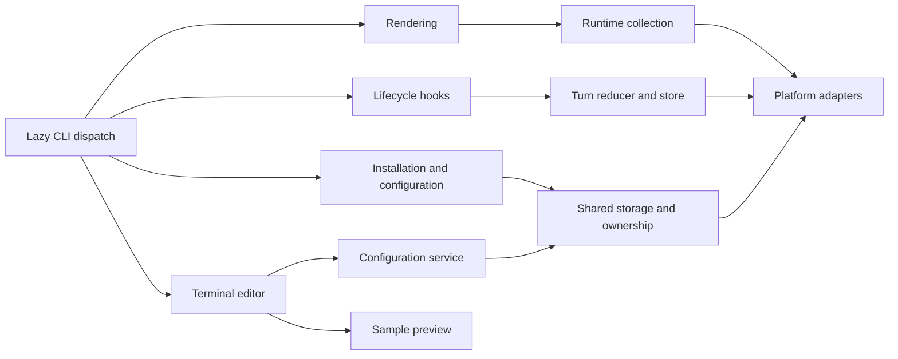

# Architecture and repository layout

**English** | [简体中文](architecture.zh-CN.md)

The Python package keeps the existing CLI, configuration formats and storage locations. Version 1.1.1 groups implementation by responsibility and retains lazy compatibility modules at the original Python paths.

```text
src/claude_statusline/
  cli.py, __main__.py, _version.py   CLI dispatch and version
  config/                           Display/features, host settings, models,
                                    shared storage, transactions and commands
  rendering/                        Formatting, palette, layout, items,
                                    timer, main/subagent output and preview
  runtime/                          Paths, caches, registry, transcript,
                                    usage, Git and prompt lifecycle
    turns/                          Pure records, locked storage and reducer
  integration/                      Ownership, capabilities, resources,
                                    installation plan/commit, doctor,
                                    hooks, launcher and result bridge
  ui/                               Models, draft editor, keys, drawing,
                                    terminal session and save/cancel lifecycle
  platforms/                        OS detection, files, processes, clocks
                                    and the Terminal.app adapter
  resources/                        Bundled configuration skill templates
  *.py                              Legacy compatibility entry points

tests/{config,rendering,runtime,integration,ui,platforms}/
tests/support.py                    Stable source locations for subprocess tests
tools/                              Validation and opt-in acceptance commands
docs/development/                   Architecture, testing and timer contracts
```

## Dependencies and boundaries

Platform adapters provide locking, atomic writes, process identity and suspend-aware clocks. Runtime collectors use those adapters; renderers consume collected data and display configuration. UI drafts save through the configuration service. Installation and configuration share the same storage lock and ownership helpers, preserving rollback and semantic conflict detection.



`render`, `render-subagents` and `hook` keep terminal editors and launchers out of their startup paths. Package initializers do not eagerly import the subsystems. Optional frontend imports remain at their use sites; sample preview uses fixed data without transcript/Git collection or persistence.

The main renderer reads official JSON on stdin and writes formatted text. The subagent renderer writes NDJSON with the existing `id`/`content` protocol. Hooks remain silent and successful when input or state is unavailable. Administrative command errors continue to use stderr and existing exit codes.

## Compatibility and resources

Original modules such as `claude_statusline.statusline`, `turn_state`, `installer`, `interactive_config` and `_platform` forward attribute reads to canonical implementations. Function, exception and model identities are shared; there is no second lifecycle store or transaction implementation. Existing module execution paths, including `python -m claude_statusline.macos_terminal`, remain usable.

Tests patch the canonical module that owns a function or constant. Assigning private globals on a compatibility module is not a configuration interface; use the documented environment variables for runtime locations.

Resources continue to load through `importlib.resources` from `claude_statusline/resources`. Terminal child processes locate Python through the root package rather than assumptions about a moved adapter's parent directories.

## Persistence

Display schema v2, feature schema v1, the schema-1 runtime mirror and lifecycle schema v3 remain compatible. Optional `duration_source` distinguishes frozen task elapsed time from eligible native calibration. Optional agent history, continuation prompt aliases and pending reports preserve a human task across host-generated result notifications. They remain bounded and do not change configuration formats. Timing transcript scan version 5 rechecks old caches without resetting cumulative usage.

Keep local ROADMAP files and raw acceptance records out of distributions. Release archives originate from a fixed verified commit; package inspection checks all canonical Python modules, compatibility entry points, resources, tests, tools and bilingual documents.

See [testing](testing.md), the [timer contract](timer.md) and the [release guide](../RELEASING.md).
