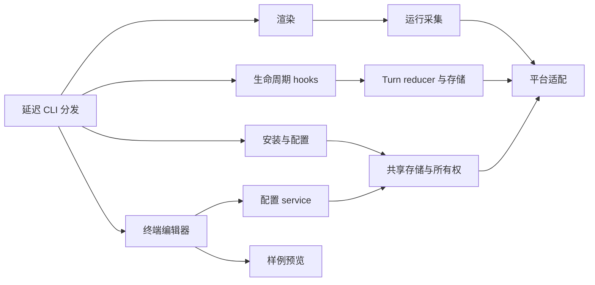

# 架构与仓库布局

[English](architecture.md) | **简体中文**

Python 包保留现有 CLI、配置格式和存储位置。v1.1.1 按职责组织实现，并在原 Python 路径保留延迟加载的兼容模块。

```text
src/claude_statusline/
  cli.py、__main__.py、_version.py   CLI 分发与版本
  config/                           显示/feature、宿主配置、模型、
                                    共享存储、事务与命令
  rendering/                        格式、颜色、布局、条目、计时、
                                    主栏/子 Agent 输出及预览
  runtime/                          路径、缓存、registry、transcript、
                                    usage、Git 与 prompt 生命周期
    turns/                          纯记录逻辑、加锁存储和 reducer
  integration/                      所有权、能力、资源、安装计划/提交、
                                    doctor、hooks、启动器及结果桥
  ui/                               模型、编辑草稿、键盘、绘制、
                                    终端会话及保存/取消生命周期
  platforms/                        系统识别、文件、进程、时钟及
                                    Terminal.app 适配
  resources/                        配置 skill 模板
  *.py                              原有兼容入口

tests/{config,rendering,runtime,integration,ui,platforms}/
tests/support.py                    子进程测试的稳定源码定位
tools/                              验证与显式启用的验收命令
docs/development/                   架构、测试及计时约定
```

## 依赖与边界

平台适配提供文件锁、原子写入、进程身份和包含睡眠时间的时钟。运行采集依赖这些适配；renderer 使用采集结果和显示配置。UI 草稿通过配置 service 保存。安装与配置共用存储锁及所有权辅助逻辑，保留回滚和语义冲突检查。



`render`、`render-subagents` 和 `hook` 的启动路径不加载终端编辑器及启动器。各子包初始化不提前导入实现。可选前端在实际使用时导入；预览只使用固定数据，不读取 transcript/Git，也不保存状态。

主 renderer 从 stdin 读取官方 JSON，输出格式化文本。子 Agent renderer 保留 `id`/`content` NDJSON 协议。输入或状态不可用时，hooks 继续静默成功退出。管理命令继续使用原有 stderr 与退出码约定。

## 兼容与资源

原有 `claude_statusline.statusline`、`turn_state`、`installer`、`interactive_config`、`_platform` 等模块将属性读取转发到正式实现。函数、异常和模型共享身份，不另建生命周期存储或事务实现。原模块运行入口继续可用，包括 `python -m claude_statusline.macos_terminal`。

测试直接 patch 拥有函数或常量的正式模块。给兼容模块赋值私有全局变量不是配置接口；修改运行目录应使用文档说明的环境变量。

资源继续通过 `importlib.resources` 从 `claude_statusline/resources` 加载。Terminal 子进程从根包定位 Python 包目录，不依赖被移动适配文件的父目录层级。

## 持久化

显示 schema v2、feature schema v1、schema-1 运行镜像和生命周期 schema v3 保持兼容。可选 `duration_source` 区分冻结的任务时间与满足条件的原生校准。可选的 Agent 历史、续接 prompt 别名和待交付报告，使宿主生成的结果通知仍属于同一人类任务；这些记录有界，不改变配置格式。计时 transcript 扫描版本升级到 5，重新核对旧缓存，不重置累计用量。

本地 ROADMAP 与原始验收记录不进入发行包。发布从固定且已验证的提交导出；包检查覆盖全部正式 Python 模块、兼容入口、资源、测试、工具和双语文档。

另见 [测试](testing.zh-CN.md)、[计时约定](timer.zh-CN.md) 和 [发布指南](../RELEASING.zh-CN.md)。
