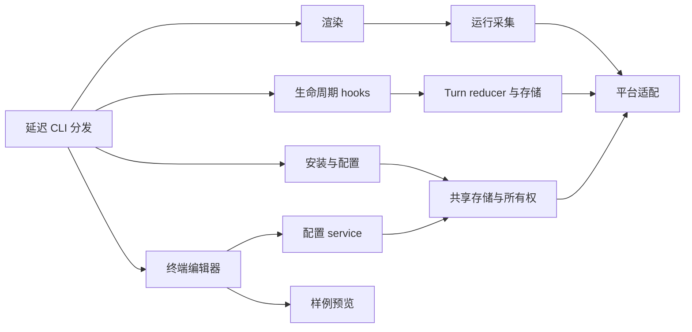

# 架构与仓库布局

[English](architecture.md) | **简体中文**

Python 包保留现有 CLI、配置格式和存储位置。实现按职责组织，并在原 Python 路径保留延迟加载的兼容模块。

```text
src/claude_statusline/
  cli.py、__main__.py、_version.py   CLI 分发与版本
  config/                           显示/feature、宿主配置、模型、
                                    共享存储、事务与命令
  i18n/                             翻译、展示与 en/zh-CN 语言包
  rendering/                        格式、颜色、布局、条目、计时、
                                    主栏/子 Agent 输出及预览
  runtime/                          路径、缓存、registry、transcript、
                                    usage、Git 与任务生命周期
    live/                           独立计时／指标观测
    timing/                         不可变暂停／恢复时钟与采样
    tasks/                          任务归属、生命周期、提交索引、
                                    原生适配、采集和锁内存储
    turns/                          转发到 tasks/ 的兼容别名
  integration/                      所有权、能力、资源、安装计划/提交、
                                    doctor、hooks、启动器及结果桥
  ui/                               外部终端编辑器与 JSON 后端
    models.py                       终端边界、结果及稳定字段 key
    editor.py, forms.py              草稿状态、字段分组及纯配置编辑
    layout.py                       板块尺寸、分组标题及可见窗口预算
    theme.py                        终端默认样式与预览颜色对
    drawing.py, keys.py              终端绘制及键盘分派
    session.py                      终端会话、保存/取消与文件操作
    protocol.py, contracts.py        JSON 后端及生成类型契约
  platforms/                        系统识别、文件、进程、时钟及
                                    Terminal.app 适配
  resources/                        配置 skill 模板
  *.py                              原有兼容入口

tests/{config,i18n,rendering,runtime,integration,ui,platforms}/
tests/support.py                    子进程测试的稳定源码定位
tools/                              验证与显式启用的验收命令
docs/development/                   架构、测试及计时约定
```

## 依赖与边界

随包接入的 TypeScript Client 编辑器放在 `mods/statusline-native`，分为可静态分析的宿主入口、纯草稿及宿主行逻辑、严格协议桥接、生成契约、页面绘制和官方测试。Python 继续负责配置与渲染。源码包保留 Mod 开发文件；`src/build_native.py` 仅把运行 manifest/模块及生成的哈希、版本、协议清单打入 wheel。安装器拥有本地目录 marketplace，通过官方插件命令接入，与兼容文件事务分阶段执行。参见[原生入口验证](native.zh-CN.md)。

`config.catalog` 定义带作用域的项目和派生兼容视图；`ui.contracts` 定义生成的前端类型，`ui.protocol` 负责 JSON describe/read/preview/apply 传输，`rendering.spans` 将生产样例转换为可绘制输出。`config.revisions` 为锁内读取及 JSON/curses 共用的保存提供覆盖安装归属的语义 revision；apply 复用配置服务事务，返回提交后的快照。参见[共享契约](contracts.zh-CN.md)。

平台适配提供文件锁、原子写入、进程身份和包含睡眠时间的时钟。运行采集依赖这些适配；renderer 使用采集结果和显示配置。UI 草稿通过配置 service 保存。安装与配置共用存储锁及所有权辅助逻辑，保留回滚和语义冲突检查。



`render`、`render-subagents` 和 `hook` 的启动路径不加载终端编辑器及启动器。各子包初始化不提前导入实现。可选前端在实际使用时导入；预览只使用固定数据，不读取 transcript/Git，也不保存状态。

主 renderer 从 stdin 读取官方 JSON，输出格式化文本。子 Agent renderer 保留 `id`/`content` NDJSON 协议。输入或状态不可用时，hooks 继续静默成功退出。管理命令继续使用原有 stderr 与退出码约定。

## 兼容与资源

原有 `claude_statusline.statusline`、`turn_state`、`installer`、`interactive_config`、`_platform` 等模块将属性读取转发到正式实现。函数、异常和模型共享身份，不另建生命周期存储或事务实现。原模块运行入口继续可用，包括 `python -m claude_statusline.macos_terminal`。

测试直接 patch 拥有函数或常量的正式模块。给兼容模块赋值私有全局变量不是配置接口；修改运行目录应使用文档说明的环境变量。

资源继续通过 `importlib.resources` 从 `claude_statusline/resources` 加载。Terminal 子进程从根包定位 Python 包目录，不依赖被移动适配文件的父目录层级。

## 持久化

当前显示 schema v7 与 feature schema v1、schema-1 运行镜像及生命周期 schema v4 独立演进，历史显示 v1/v2/v3/v4/v5/v6 在保存前只在内存补齐默认值。可选 `duration_source` 区分冻结的任务时间与历史原生证据；新原生单轮耗时独立保存。可选的 Agent 历史、续接 prompt 别名和待交付报告，使宿主生成的结果通知仍属于同一人类任务；这些记录有界，不改变配置格式。计时 transcript 扫描版本升级到 6，重新核对旧缓存，不重置累计用量。

本地 ROADMAP 与原始验收记录不进入发行包。发布从固定且已验证的提交导出；包检查覆盖全部正式 Python 模块、兼容入口、资源、测试、工具和双语文档。

另见 [测试](testing.zh-CN.md)、[计时约定](timer.zh-CN.md) 和 [发布指南](../RELEASING.zh-CN.md)。

## 原生编辑器结构

唯一编辑器 Mod 源为 `mods/statusline-native`。宿主 API 留在 `hooks/register.ts`，草稿与数值规则在 `lib/editor/`，输入校验、按键及设置在 `lib/client/`，独立端口快照在 `lib/session.ts`。`ui/client/` 维护 Client 输入/绘制；`ui/components/` 提供共享板块：`section.ts` 绘制主题框线，`preview.ts` 绘制独立于宿主主题的终端默认背景样例；`ui/layout.ts` 计算正文预算。测试对应 backend、client、editor、integration、UI。

`/statusline-configure` 的 Python curses UI/平台启动器保持独立；Mod 只注册 `/statusline-configure-native`。两者可同时安装和打开，保存共用配置服务、revision 校验及事务锁。Client 不访问文件或启动进程，通过有序累积消息批次与宿主通信；快照深复制以隔离宿主冻结行为，序号确认/去重及 epoch 防止重复或迟到输入。递归打包包含 Client 模块，排除测试、宿主声明、依赖及原始验证记录。

正式版编辑器默认由 config.editor_defaults 共享，两个偏好独立，明确参数优先。安装、slash 执行和 doctor 使用相同外部默认；缺失偏好默认启用，明确 false 持久关闭。宿主门槛为外部 2.1.258、Client 2.1.287，版本不支持或未知时分别暂挂。已核验所属的插件通过受锁保护、备份和回滚的设置/owner 事务暂停，不依赖新版宿主 API；仅工具暂挂在恢复兼容后自动启用。

## 独立显示指标

`rendering.metrics` 负责严格数值／上下文解析、重置倒计时及会话分项格式化；主渲染状态共享不增加 I/O 的原始整数 usage 快照，每次刷新捕获一个时钟并缓存实时采集结果。预览提供固定时钟与样例值；作用域目录新增项通过生成契约传递至两个编辑器和向导，无需变更 schema／协议。见[显示指标定义](../DISPLAY_ITEMS.zh-CN.md)。

Usage 状态在既有整数统计旁记录可选的输入／输出观测标记。Usage scan version 3 为旧会话恢复一次标记，包含嵌套子 Agent，不重新添加已折叠的消息 ID。不完整的 cost-state 快照仅更新已观测的计数器，各计数器保留自己的主／子 Agent 增量锚点。格式化采集接口和计时生命周期保持兼容。

## Phase 4 配置边界

Python `config.formatting`、`advanced`、`presets`、`transfer`、`editor_fields` 分别负责格式规则、纯草稿编辑、预设展开、可移植文件与共享表单描述。显示 schema v7／协议 v9 与编辑器启用偏好、运行镜像及生命周期独立。两种编辑器保存完整草稿并沿用配置服务；旧命令保留新增字段，显式 reset 恢复默认。

curses `ui.forms` 与 Client `lib/client/forms.ts` 从同一描述展开逐项格式、Layout 精简及全局设置。原生 hooks 执行后端／文件操作，`lib/preferences.ts` 管理实际宿主行及支持的控件，Claude API 应用保持独立。生产与样例渲染共用格式／显式布局，Git／transcript 继续按需采集；不增加 Phase 5 运行指标。

## 独立运行采集

默认关闭的 `mods/statusline-runtime` 与 Client 编辑器独立。两 Mod 以明确身份复用所有权安装器和资源清单。`runtime/live/` 负责严格运行协议、会话锁、原子观测状态及有界历史；配置事务和 `runtime/turns` 保持分离。采集器只发布元数据，保留准确重试身份，恢复会话后重新绑定，并报告过期或不完整证据。详见[实时契约](live.zh-CN.md)。

## Phase 5 指标迁移

显示 schema v4 新增可空 `metrics.branch_diff_base_ref`；配置协议 v3 在两个编辑器、冲突、预览和便携文件中保留它。v1/v2/v3 读取不写盘，真实保存才备份迁移；独立运行观测协议为 v2，兼容 v1 但不声明完整执行覆盖。已提交分支差异和已结束代理时长冻结见[指标定义](../DISPLAY_ITEMS.zh-CN.md)。

## 外部编辑器结构（v1.6.1）

`ui.layout` 只计算几何与可见分组窗口，标题与字段共同消耗屏幕行，但标题不参与选择。`ui.forms` 复用 canonical 描述，补齐原有设置和文件操作的稳定 key／分组，并集中排列外部字段；`ui.editor` 与 `ui.keys` 按字段身份分派，绘制只负责终端输出。JSON 描述、内部 Client 排列和配置协议继续兼容，外部展示顺序独立于共享配置定义。

内容与 Preview 使用各自的实际内宽；窗口缩放保留草稿和输入缓冲。测试位于现有 UI／集成测试分层，独立 PTY 工具位于 tools。生产 renderer、安装器、运行观测及兼容入口沿用原有职责。

## 任务时钟结构

正式任务实现位于 `runtime/tasks`：模型、reducer、Agent、原生适配、增量证据、采集及只读视图分别承担独立职责；`runtime/timing` 提供纯逻辑、可序列化时钟。原 `runtime/turns` 模块引用相同正式模块，保留 Python 入口、函数共享身份和原存储位置。

运行采集具有两个独立模式：兼容安装默认启用原生计时，高级指标仍按需启用；两者消费有界、去重元数据。任务结果由正式任务存储决定，高级视图使用明确关联和已核验生命周期证据。格式化不改变任务状态，采集／归并先于格式化。显示 schema 5、配置协议 6、运行协议 2、运行偏好 schema 2 独立演进。

## TUI 布局与快捷键

Client 的 `ui/layout.ts` 按终端尺寸计算内容、Preview 和两行操作提示预算；统一栏目组件在框顶绘制标题，紧凑模式保留一行标题。`lib/editor/navigation.ts` 按字段与分组标题实际行数填充页面，并让翻页与绘制使用同一分组页面计算；字段 key 在缩放后保持稳定，标题不可选择。Layout 先展开模式和所有行边界，再按主栏顺序展开逐项适配；格式详情集中格式与适配分组。

两编辑器分别用纯快捷键分段模块生成完整按键／作用组。按键使用主要文字色并加粗，说明保持普通可读文字；Client 跟随已应用的 Claude 主题，外部 curses 主界面使用终端默认色和反色选择。`ui.theme` 集中管理终端默认背景上的前景颜色对与能力降级。预览填充、颜色重置及无色 span 使用终端默认色，样例保留所选生产配色；处理默认色不支持、无色和分配失败／不足。宽度不足时使用短说明并按组裁剪。外部表单仍使用既有分组滚动窗口，宿主偏好仍由 h 展开并单独 Apply；绘制不执行文件或宿主操作。

## 共享界面语言

`config.ui_preferences` 管理独立 schema v1 偏好事务；`i18n` 管理延迟资源、语义消息和展示元数据。Python JSON 语言包生成原生 `lib/i18n/generated-locales.ts`，由 CI 和分发包检查保证一致。CLI 解析器与两个编辑器传递显式语言，同时保留英文诊断及规范机器目录。render／hook 快速启动路径不加载界面资源或偏好。

外部会话与原生宿主处理用户选择后的即时语言写入，仅成功后更新界面并保留未保存草稿。curses 重绘物理屏幕，两端复用宽度／裁剪工具重算单元格预算。错误语义元数据通过独立复制的 Client 快照传递。语言不进入显示 revision 或可移植 payload。见[翻译贡献](i18n.zh-CN.md)与[偏好协议](contracts.zh-CN.md#界面偏好与消息操作)。

## 独立的状态栏语言

显示 schema v7 与配置协议 v9 将 `statusline_language` 保留在完整草稿、revision、预览和可移植文件中。`i18n.statusline` 读取同一套 JSON 资源生成的 Python 子集，正常渲染不读 UI 偏好或解析 UI JSON。格式化边界翻译完整短语和已知值，采集存储继续保留原代码；按项目定义的前缀元数据区分标签与用户数据。共享编辑描述加入留在显示草稿中的选择，UI 语言继续是立即保存的偏好。
